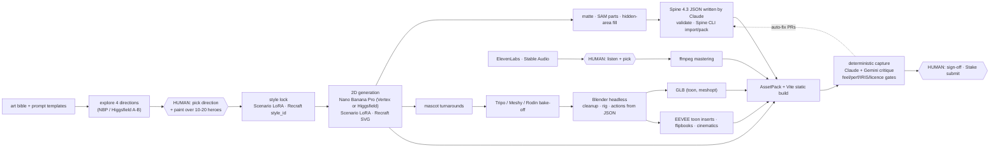

# Documentation

This is a premium, animation-first video slot for **Stake Engine**, produced with an AI-driven pipeline that Claude controls end to end. Humans step in at the points where they add something AI cannot.

- **Working theme:** "SWAMP FUNK", a neon bayou juke joint with Gumbo the gator bouncer and Baron Croak the bullfrog DJ. It is a placeholder you can swap.
- **Games:** one shared engine, one folder per game (`src/games/<id>/`, picked with `GAME=<id>`):
  - `swamp-funk` (default): a 7×5 cluster-pays tumble game with multiplier spots;
  - `bass-drop` — **Swamp Funk: Bass Drop**: a 6×6 cluster tumble with a Groove Meter (Wilds every 10 connected symbols, Juke Jam at 40, Mega Mix at 60). Design: [games/bass-drop/](games/bass-drop/README.md).
- **Front end:** Vite + TypeScript + PixiJS 8.21 + three 0.186 + spine-pixi-v8 4.3.13 + GSAP 3.15.

## Start here

| If you want to… | Read |
|---|---|
| Know what to buy, install and pay for, and what AI can't do | **[STACK.md](STACK.md)** (start with the TL;DR and "Image route") |
| Run production step by step | **[PIPELINE.md](PIPELINE.md)** (start with "Tooling status" and "How Claude runs the pipeline") |
| Run one pipeline tool (flags, outputs, gates, exit codes) | Its README: [gen](../tools/gen/README.md), [matte](../tools/matte/README.md), [spine](../tools/spine/README.md), [blender](../tools/blender/README.md), [gltf](../tools/gltf/README.md), [video](../tools/video/README.md), [audio](../tools/audio/README.md), [assets](../tools/assets/README.md), [licence](../tools/licence/README.md) |
| Know the exact names, frames, events and feel constants the art must hit | **[ANIMATION_CONTRACT.md](ANIMATION_CONTRACT.md)** |
| Keep the look consistent and non-sloppy | **[ART_BIBLE.md](ART_BIBLE.md)** + [`art/bible/artbible.json`](../art/bible/artbible.json) + [`art/bible/prompts/`](../art/bible/prompts/README.md) |
| Pass Stake Engine approval | **[STAKE_ENGINE.md](STAKE_ENGINE.md)** |
| Add or change a game (engine vs game folder, `GAME=`, per-game builds) | [Multi-game engine](#3-multi-game-engine) below + the root [README](../README.md#multi-game-layout) |
| Build Bass Drop's features (meter, bass drop, Juke Jam, Mega Mix) | **[games/bass-drop/](games/bass-drop/README.md)** (DESIGN, ANIMATION_SET, layout.json) |
| Wire up the MCP servers | **[MCP_SETUP.md](MCP_SETUP.md)** + [`.mcp.json.example`](../.mcp.json.example) |
| Check licences and provenance | [`licenses/allowlist.json`](../licenses/allowlist.json), [`licenses/denylist.json`](../licenses/denylist.json), [`art/manifest.schema.json`](../art/manifest.schema.json) |
| See the raw research and its sources | [research/](research/README.md) |

## The system on one screen

### 1. AI production pipeline



**Conductor:**
- **Claude Code (Opus 5.5)** on a Linux GPU workstation via Remote Control, in Anthropic cloud sessions, and in GitHub Actions.
- MCP servers are used for exploring; **committed scripts do production**.
- Every file gets a provenance row (`art/manifest.json`), and a `licence-audit` check (`pnpm licence:audit`) blocks anything off the allowlist.
- Every tool has an npm script: `gen:*`, `matte`, `matte:variants`, `spine:*`, `blender:*`, `anim:check`, `gltf:*`, `video:*`, `audio:*`, `assets:pack`, `licence:audit`, `capture`, `qa:review`, `qa:approval`, `lab`, `gallery`. [PIPELINE § Tooling status](PIPELINE.md#tooling-status) says what exists, what is planned and what is not verified yet: the real Spine CLI, the real Blender binary with GPU EEVEE, and live vendor calls.
- **Gemini 3.1 Pro** is the blind second judge. OpenAI models are excluded unless OpenAI clears real-money gambling in writing ([why](STACK.md#openai-gpt-6-astra-and-chatgpt-atlas)).

### 2. Front-end runtime

```
 URL params ─► env/ ─► rgs/client (authenticate · play · end-round · replay) ─► book/player (for-await book events)
                                                                                   │ broadcastAsync (Promise.all)
             flow/ FSM: idle · spinning · presenting · autoplay · resume · replay  ▼
             core/clock (ONE clock: Pixi ticker → GSAP → Spine → three; hit-stop; manual stepping for QA)
             core/timing (every feel constant; live-tuned in ?dev=lab)
     ┌──────────────┬───────────────┬───────────────────┬─────────────┬──────────┬─────────┐
   board/        symbols/        present/            mascots/        fx/       audio/ ui/
   drop·tumble   SymbolRig +     big win · free      three.js toon   particles  SFX/music
   spots·heat    pooled Spine    spins · win labels  → RenderTarget  filters    HUD + DOM
                 (spine-pixi-v8)                     → Pixi sprite   shake      menus
```

**Layer stack, back to front:**
1. background (cover-scaled);
2. background FX;
3. glass panel;
4. heat tiles;
5. spot numbers;
6. **symbols** (scissor-masked);
7. **frame**;
8. logo;
9. `winLayer` (win pops spill over the frame);
10. **mascots** (three.js drawn into a render target inside Pixi's WebGL2 context, after `renderer.resetState()`);
11. HUD;
12. big-win / free-spins overlays;
13. DOM modals.

**Layout spaces** (per game, `src/games/<id>/layout.ts`):
- landscape 1920×1080;
- portrait 1080×1920;
- tablet 1920×1920;
- compact 960×540 for popouts, with the 3D mascots off.

**Speed:** one gameplay timeline scaled 1× / 2× / 3× for normal, turbo and super turbo, all within the jurisdiction flags.

**Dev and QA hooks:**
- `?dev=lab` (`pnpm lab`): Tweakpane, scenarios, and timing export. Every module's timing table registered with `registerTiming` is tunable, not just the core `TIMING`;
- `?dev=gallery` (`pnpm gallery`);
- `?spineDemo=<symbolId>` (DEV only): binds the AI-authored demo Spine rig to a symbol in game. It is stripped from `dist/`;
- `window.__slot.scenario(name)`, `__slot.setTiming(path, value)`;
- `tools/capture/shot.mjs` (`pnpm capture`);
- `tools/qa/animation-review.mjs` (`pnpm qa:review`);
- `tools/qa/approval.mjs` (`pnpm qa:approval`);
- the mock RGS with each game's fixture books (`mock/games/<id>/`).

Architecture decisions and their evidence: [research/frontend-decisions.md](research/frontend-decisions.md).

### 3. Multi-game engine

```
 GAME=<id> ─► vite.config.ts: @game -> src/games/<id>/ · __GAME_ID__ · <title> · mock/games/<id>/ · dist/<id>/
              tsconfig.json (@game = swamp-funk) · tsconfig.bass-drop.json (@game = bass-drop)

 engine (src/**)                         shims                      game (src/games/<id>/)
 board · symbols · flow · book · ...  ─► config/game.ts      ─► @game/config    GRID · SYMBOLS · WIN_TIERS · SPOT_BANDS · FEATURES · BET_MODES · ATTRACT · DEV_FIXTURE_ALIASES
                                         config/layout.ts    ─► @game/layout    LAYOUTS (4 LayoutSpecs, HUD anchors included)
                                         ui/dom/gameInfo.ts  ─► @game/gameInfo  modes · paytable specials · feature rule sections
 main.ts                             ─────────────────────► @game/modules   createModules(ctx)
 book/handlers.ts + book/gameEvents  ─────────────────────► @game/book      GameBookEvent · gameBookHandlers · foldGameEvent · restoreGameScene
 game/events.ts (GameEvents = Core & …) ──────────────────► @game/events    GameSceneEvents
 i18n/index.ts                       ─────────────────────► @game/i18n      GAME_STRINGS (merged over the engine tables)
 assets/placeholder/ProceduralArt    ─────────────────────► @game/art       SYMBOL_BUILDERS · ART_MANIFEST
```

- **What stays generic:** every module reads the grid from `GRID` (reels, rows, padded rows) and the cell/pitch from the layout, so any cluster grid works (7×5 and 6×6 today). Multiplier spots are an engine feature switched on per game (`FEATURES.multiplierSpots`; the tiles are always drawn).
- **Game book events** (Swamp Funk `updateGrid`; Bass Drop `meterUpdate`, `wildDrop`, `stickyWilds`, `featureTrigger`, `featureUpgrade`) are played by the game's handlers through a small `GameEventEnv` (`emit`, `state`, `hudChanged`, `setGameType`), which the flow and the DEV scene players share. `board:transform` (`drop` / `impact` / `morph` / `set`) is the core way for a game to replace symbols in place.
- **Per game, not shared:** bet modes and costs, the mock RGS settings (`mock/games/<id>/mock.json`) and books, localStorage keys, the page title, the dependency-optimizer cache (`node_modules/.vite/<id>`), the build folder.
- The pipeline tools that read the symbol registry (`tools/matte`, `tools/blender/slotbl/palette.py`, `tools/spine/validate.mjs`) read `src/games/$GAME/config.ts` (default swamp-funk).

## Decisions waiting on you

1. **Production image route.** Vertex + Scenario (recommended) or Higgsfield (after written clearance: training opt-out, gambling, EU/UK). See [STACK § Image route](STACK.md#image-route-higgsfield-or-vertex--scenario-you-decide).
2. **Theme, working title and art direction.** Keep SWAMP FUNK or swap it; choose a unique title; pick 1 of 4 explored directions; hire the paintover artist.
3. **Budget tier and hardware.** Start with Phase 1 lean (no workstation) or go straight to Full AAA (RTX PRO 6000 or RTX 5090). Spine Professional vs **Enterprise** depends on whether company revenue plus financing reaches $500k/yr.
4. **People and contracts.** A character animator for the mascots (recommended), an optional Spine animator, gaming/IP counsel, and **ElevenLabs Enterprise** or a human sound designer.
5. **OpenAI.** Ask for written clearance (to use GPT-6 Astra / GPT Image 2.5), or accept the exclusion.
6. **Symbol `land` headroom (you or the art lead).** The Spine validator's "land stays inside the cell" rule conflicts with the art bible's cell fill and the runtime's fit-to-cell. Choose: allow overflow into the gap, cap the rebound, require headroom, or gate relative to the rest silhouette. See [ANIMATION_CONTRACT §3.1](ANIMATION_CONTRACT.md#31-land-contact-frame-and-cell-gate-open-decision).
7. **Required mascot morphs (you or the art lead).** Are all six morphs required, or only `surprised`/`angry` (what the GLB gate enforces today)? See [ANIMATION_CONTRACT §7.4](ANIMATION_CONTRACT.md#74-morph-targets--15).

Also pending, from the math side:
- whether spot multipliers grow additively or by doubling;
- the bet modes and their costs (they cannot be added after approval);
- the wincap;
- languages beyond English;
- whether to launch on Stake.us (social mode).

## Conventions

- **Status tags:**
  - **(U)** / **UNVERIFIED**: from a secondary source or a blocked vendor page; check before paying.
  - **[planned]**: not in the repo yet.
  - **[delta]**: the runtime needs a small change.
  - **OPEN DECISION**: the pipeline and the runtime or art bible disagree; the options are listed where it appears.
- **Where things live:**
  - `art/_raw/`, `art/_work/`: generated and gitignored.
  - `art/source/`: approved sources, git-LFS.
  - `public/assets/`: written only by scripts.
  - `build/`: generated and gitignored (`build/frames`, `build/spine`, `build/pack`, `build/qa`).
- **Ownership:** docs, the art bible, licences and the MCP example live here. `src/**` and `tools/capture|qa/**` are owned by the runtime and QA engineers. Each pipeline tool under `tools/` documents itself in its own README.
