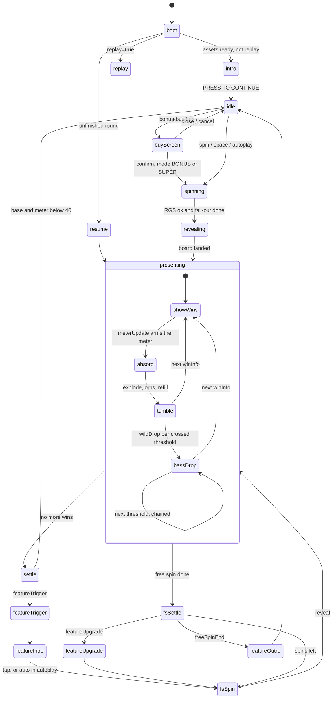

# Swamp Funk: Bass Drop — game design and presentation spec

**Game id:** `bass-drop` · **Status:** binding spec for the implementation and art tracks · **Owner:** docs/games/bass-drop/**

This document is the binding contract for everything the player sees and hears in Bass Drop. The implementation track builds from it, the art track produces assets from [ANIMATION_SET.md](ANIMATION_SET.md), and QA checks against section 24. Machine-readable layout: [layout.json](layout.json). Wireframes rendered from it: [wireframes/](wireframes/) (`python3 docs/games/bass-drop/wireframes/render.py`).

It extends, and never contradicts, the repo-wide contracts:
- [ANIMATION_CONTRACT.md](../../ANIMATION_CONTRACT.md) for names, frames, events and feel constants;
- [ART_BIBLE.md](../../ART_BIBLE.md) for the style locks;
- [STAKE_ENGINE.md](../../STAKE_ENGINE.md) for approval rules.

Where Bass Drop needs something new in a shared contract, the change is listed as a **contract request (CR-n)** in section 23 instead of being assumed.

Tags used here:
- **[RM]**: a starting value that must be re-measured from the Dragonspire Frostfall reference capture (protocol in section 22, status in section 22.1: not measured yet).
- **[M-n]**: a math-owned decision. The front end ships the default given here and must render whatever the book says.
- **[CR-n]**: a change to a shared contract (`src/game/events.ts`, the book event contract, ANIMATION_CONTRACT, `tools/spine/contract.json`).

---

## 0. Reference study (what we took, what we did not)

Sources (none of them is in the repo: third-party frames are never committed, and our own captures are local QA output):
- `ref_dragon_1.png` (Dragonspire intro, 1073×604) and `ref_dragon_2.png` + `ref_dragon_2_grid.png` (Dragonspire base game, 1079×607): the user's screenshots, kept in the session scratchpad only;
- our Swamp Funk captures from `tools/capture/shot.mjs` at 1920×1080 (regenerate them; they are not committed).

The live demo has not been captured yet (log in section 22.1):
- first attempt: the proxy refused `paperclip.live.engine.io` and `rgsd.engine.io` (HTTP 403 on CONNECT);
- second attempt (2026-09-26, run `probe1`): the network allowed both hosts and the page plus all 47 page/asset requests loaded, but the RGS rejected the demo session (`POST /wallet/authenticate` → HTTP 400 `ERR_VAL` "session not found"). The game never left its loading screen, and 0 frames were captured.

**Every timing in this document is still derived from our own `timing.ts` plus AAA norms, not measured from Dragonspire.** Timings that need the capture carry **[RM]**. Nothing in motion has been observed: the table below is read off two stills only.

Measured from the stills (proportions of the viewport, converted to our 1920×1080 space):

| Element | Dragonspire | What Bass Drop does |
|---|---|---|
| Grid | 5×5, centred (x centre 50.2%); column pitch ≈ 8.0% of viewport width (≈ 154 px at 1920); square cells, so the grid is **≈ 71% of viewport height** | 6×6, centred; cell 124 + gap 4 = 128 pitch; grid 764 px tall = **71% of 1080** (same proportion) |
| Meter | Dark stone ring with a gold inner rim; "0/35" in frosted cyan in the centre disc; ring Ø ≈ 14% of width (≈ 267 px at 1920); centre ≈ (16.4%, 31.3%) = (316, 338); a lantern cap at 12 o'clock; a dragon perched on the upper-right of the ring. The still shows 0/35 while four special wilds are on the board (per-spin reset, or a frame just after one: section 23, R-3) | **Groove Meter**: a speaker woofer, ring Ø 320 at (248, 318). "23/60" in the dust cap. Six notch badges on the rim. Gumbo leans on the speaker stack; the cone itself is the "creature" (it breathes, pumps and booms) |
| Mini panel under the meter | A 5×5 grid of empty blue cells (the main board's shape) under a dragon crest with wings; its function is not visible in a still (it may be a position map, e.g. where special wilds landed: unconfirmed) | Not copied. Our "next drop" chip hangs under the meter. **[RM]** find out what the panel does before deciding whether we need an equivalent (section 23, R-4) |
| Symbols | Glossy cel gems with snow caps; outline ≈ 3.5% of the cell; highs are crown, horn, scroll, blade | We keep the Swamp Funk set (outline 3% of the cell, top-left light, plum extrusion). It already matches the reference's finish level |
| Special wilds | A 2×2 dragon wild with a huge "100x" in ice letters overlapping its gold frame; 1×1 dragon wilds with "2x"/"5x" at the bottom; one "5x" wild drawn translucent (ghosted: arriving or pending) | **Multiplier badge** at the bottom-centre of the W: plate 64% × 40% of the cell, digits **30% of the cell** tall, overlapping the cell's bottom edge by 10%. A **ghosted landing shadow** on target cells while a wild is in flight. No 2×2 wild (not in our mechanics) |
| Frame | Ornate ice-dragon frame; dragons perched on both top corners; ice crystals on the posts; thin light column separators | Cypress frame (Swamp Funk) + **two horn speakers bolted on the top corners** (our "perched dragons"). They pump on every boom. The neon tube on the beam carries the drop charge |
| Logo | Top right, mirrored against the meter at top left | Same composition: logo top right, meter top left |
| HUD | Bottom bar: menu, balance, bet ±, large round spin, autoplay and turbo circles, a publisher button | **Not adopted.** We keep the Swamp Funk hex HUD (section 14) |
| Intro | 3 ornate cards, the centre card lowered with the logo above it, art + glowing title + 2–3 lines of caps body, "PRESS TO CONTINUE" | Same structure (section 12): GROOVE METER / JUKE JAM / MEGA MIX, max-win footer line |

IP rule (ART_BIBLE §0): we match the reference's **quality, composition and energy**, never its characters, names, ice/dragon look or layout-as-identity. Tome of Madness is a mechanics inspiration only (portal meter → special wilds → bonus).

---

## 1. Pitch and pillars

**Every connection feeds the Groove.** Clusters explode into energy orbs that fly into a speaker-stack meter. Every 10 connections the bass **drops**: the speaker booms, the room shakes, and Wilds are fired onto the board. 40 connections in one spin opens **Juke Jam**, 60 opens **Mega Mix**.

Pillars:
1. **Cause and effect is always visible.** Symbol → link → orb → meter tick → threshold → boom → wild → new cluster. No step happens off screen.
2. **The bass drop is the signature beat.** It gets the biggest shake, the deepest sound and a mascot sync, and it reads at super turbo too.
3. **One tempo.** Booms, meter pumps and mascot loops sit on the music grid (100 BPM base, 106 Juke Jam, 112 Mega Mix). Gameplay timing is never delayed to wait for a beat: the music follows the game (section 17).
4. **Readable at 64 px.** Meter value, notches and wild multipliers must read on a phone in portrait.
5. **Swamp Funk family.** Same world, symbols, outline and light rules, same hex HUD. New: the speaker stack, the DJ booth, the horns and 2D Spine mascots.

---

## 2. Mechanics (final for the front end)

| Rule | Value |
|---|---|
| Grid | 6 reels × 6 rows. Book boards are `[reel][paddedRow]`, 6 × 8, with rows 0 and 7 as off-screen padding (visible rows 1..6) |
| Pays | Cluster pays: 5+ orthogonally connected identical symbols; `W` substitutes |
| Tumble | Winners explode; survivors fall; new symbols enter from the top. Stake web-sdk rule per reel: `combined = newSymbols[reel] ++ survivors`, with `newSymbols[reel][0]` top-most. **No exceptions**: Mega Mix sticky wilds tumble like any symbol within a spin (section 9) |
| Symbols | H1 Golden Boombox, H2 Vinyl, H3 Crawfish, H4 Hot Sauce, L1–L5 A K Q J 10, `W` Wild. **No scatter** (`S` is unused in Bass Drop) |
| Groove Meter | Counts every exploded (connected) symbol of the round: `meterUpdate.delta` = exploding count (wilds included). Displayed as `value/60`. It is not clamped (base values like 79 happen); drops stop at 60 (see Bass drops) |
| Bass drops | Every multiple of 10 crossed **up to 60** (10, 20, 30, 40, 50, 60) triggers one `wildDrop`; the multiples above 60 are neither listed in `meterUpdate.thresholds` nor dropped (mock math, `METER.overflowWilds` all 0). Default wilds per drop: 10→1, 20→1, 30→2, 40→2, 50→3, 60→3 (`GROOVE.wildsPerDrop` in `src/games/bass-drop/config.ts`; used only for the "next drop" chip, since the book always says how many wilds land) |
| Base round end | meter ≥ 60 → **Mega Mix** (10 free spins); else meter ≥ 40 → **Juke Jam** (8 free spins); else nothing. **The meter resets at every base spin** (stateless rounds, section 21) |
| Juke Jam | The meter restarts at 0 at the trigger, then persists across its free spins. Drop wilds carry ×2..×5 (`sticky:false`); a cluster wins × the **sum** of the wild multipliers in it (`meta.wildMult`). Reaching 60 upgrades to Mega Mix (+4 spins) after that free spin |
| Mega Mix | The meter restarts at 0 (at the trigger, and again at an upgrade). Drop wilds carry ×2..×10. A drop wild with `sticky:true` makes its target cell a **home** for the rest of the feature: within a spin it is an ordinary wild (it wins, explodes, feeds the meter and falls with gravity), and at **every later free-spin reveal it respawns at its home** (`stickyWilds` lists the homes). Each `winInfo` it is part of adds +1 to its multiplier (cap ×25), shown from the next reveal. The mock caps the home registry at 5; later drops are one-shot `sticky:false` multiplier wilds ([M-10]) |
| Bonus buy | `BONUS` 100× → Juke Jam; `SUPER` 300× → Mega Mix. Both need a confirm step (cost > 2×) |

Math-owned decisions, with the FE default that ships until math says otherwise. The mock math (`tools/mockmath/bass-drop/`, rules in [mock/games/bass-drop/README.md](../../../mock/games/bass-drop/README.md)) has already decided most of them, and the defaults below follow it (checked against the generated books).

- **[M-1] Juke Jam start value.** The meter restarts at **0** at `featureTrigger` (mock rule; no event says so, so the FE resets it itself behind the wipe). A `meterUpdate {delta:0}` before the first free-spin reveal would override it silently (CR-2).
- **[M-2] Mega Mix meter.** Restarts at **0** at `featureTrigger` and again at `featureUpgrade` (mock rule; the FE resets it behind the upgrade screen). It keeps counting past 60 (values like 118 happen), but **no threshold above 60 is listed or dropped**: at ≥ 60 the meter shows the MAX state (section 6.7). The FE still tolerates a threshold T > 60 if a future math lists one: notch `((T/10 − 1) mod 6) + 1`, one lap pip per full 60.
- **[M-3] Natural wilds on reels.** Base and Juke Jam strips carry rare natural `W` (multiplier 1); the Mega Mix strip has none. W has a normal `land`.
- **[M-4] Sticky wilds and the meter.** Every winning cell explodes, **sticky wilds included** (they are in `explodingSymbols`), so a winning sticky emits an orb like any symbol. The counter follows `meterUpdate.value`, never the orb count.
- **[M-5] Sticky increments.** +1 per `winInfo` in which the wild is part of at least one cluster, cap ×25. The new value is reported by the **next free-spin reveal** (the reveal board holds `{name:'W', wild:true, multiplier}` at each home) and its `stickyWilds`; the FE animates `mult_up` from that diff (section 9). The sticky registry is keyed by **home cell**, not by where the wild currently stands.
- **[M-6] Drop targets.** Never a cell holding a `W` and never a Mega Mix home. The FE tolerates a violation: it replaces the cell anyway and flags it in the dev inspector (no console output).
- **[M-7] Bought feature books.** The mock re-draws the buy's base spin until it earns the bought feature (40–59 → BONUS, ≥ 60 → SUPER), so a buy book starts with a **real base reveal** and plays exactly like a natural trigger. The FE also accepts a book that starts directly with `featureTrigger` (then it skips the meter overload and plays the wipe + intro).
- **[M-8] `featureUpgrade` placement.** Mock: after the `setTotalWin` of the free spin in which the Juke Jam meter reached 60, before the next `updateFreeSpin` (whose `total` already includes the +4). The rest of that spin is still Juke Jam: its 60-drop wilds are ×2..×5, not sticky. At most one upgrade. The FE plays it wherever it arrives.
- **[M-9] Wincap.** 5,000× in the mock (`WINCAP_X`); `maxWinX` for the rules/intro comes from the bet-mode table and must be kept equal to the math. The capping step is `winInfo · meterUpdate · updateTumbleWin · wincap · setWin · setTotalWin`: **no `tumbleBoard` and no `wildDrop` follow**, even if that `meterUpdate` listed thresholds (section 6.3 step 10).
- **[M-10] Sticky registry cap.** The mock sets `sticky:true` on the first 5 Mega Mix drop wilds only (`FEATURES.super.maxSticky`); later Mega Mix drops are one-shot ×2..×10 wilds (`sticky:false`). The user spec says every Mega Mix drop wild is sticky, so this cap is an open math decision; the FE follows the flag either way.

---

## 3. Event contract and front-end handling

### 3.1 Book events (math → FE)

Amounts are bet multiples ×100. Positions use padded rows.

```
reveal        {board, gameType:'basegame'|'freegame', anticipation:number[6]}
winInfo       {totalWin, wins:[{symbol, clusterSize, win, positions,
                 meta:{globalMult, clusterMult, winWithoutMult, overlay:{reel,row}, wildMult}}]}
meterUpdate   {value, delta, thresholds:number[]}        // after winInfo; delta = exploding count
updateTumbleWin {amount}
tumbleBoard   {newSymbols, explodingSymbols}              // newSymbols[reel][0] is top-most
wildDrop      {threshold, wilds:[{reel,row,multiplier,sticky}]}   // AFTER the refill; each wild REPLACES its cell
stickyWilds   {wilds:[{reel,row,multiplier}]}              // Mega Mix: the home registry after each free-spin reveal
setWin        {amount, winLevel};  setTotalWin {amount}
wincap        {amount}                                     // round capped: follows the capping updateTumbleWin (no tumbleBoard)
featureTrigger {feature:'bonus'|'super', meter, totalFs}    // base round end
featureUpgrade {from:'bonus', to:'super', addFs}            // 60 reached during Juke Jam
updateFreeSpin {amount, total};  freeSpinEnd {amount, winLevel};  finalWin {amount}
```

**Order per tumble step:** `winInfo → meterUpdate → updateTumbleWin → tumbleBoard → (wildDrop × crossed thresholds, ascending) → next winInfo …`

Mock extras the FE must accept: board cells are symbol objects (`{name}`, `{name:'W', wild:true}`, and `{name:'W', wild:true, multiplier}` at Mega Mix homes on a reveal board); `reveal` also carries `paddingPositions`; `anticipation` is always all zeros (no scatter); `stickyWilds {wilds:[]}` is emitted on Mega Mix spins with an empty registry.

Never present in Bass Drop books: `updateGrid`, `freeSpinTrigger`, `freeSpinRetrigger`, `updateGlobalMult` (the core handlers stay registered).

### 3.2 Handler → scene event mapping (new handlers in bold)

The engine plays the core events (`src/book/handlers.ts`). The bold ones are **game events**, handled in `src/games/bass-drop/book.ts` (`gameBookHandlers`, through the engine's `GameEventEnv`). Their scene events are declared as `GameSceneEvents` in `src/games/bass-drop/events.ts`, so no core event type changes for them.

| Book event | Scene event(s) | Blocking? | Notes |
|---|---|---|---|
| `reveal` | `mode:change`?, `board:reveal` | yes | In Mega Mix the W at each home cell is part of the board; with the CR-10 hold set it stays standing through the fall-out instead of dropping in again (section 9.3) |
| `winInfo` | `board:showWins` | yes | Links + outline + labels (section 7) |
| **`meterUpdate`** | **`meter:update`** `{value, delta, thresholds}` | **no**: arms the meter and resolves at once | The meter launches the orbs itself on the next `board:tumble` (section 6.3). `delta:0` means a silent set (CR-2) |
| `updateTumbleWin` | `win:tumble` | no (count tweens in parallel) | |
| `tumbleBoard` | `board:tumble` | yes: `Promise.all(board explode + refill, meter orbs)` | The meter subscribes to `board:tumble` and returns its orb promise |
| **`wildDrop`** | **`wild:drop`** `{threshold, wilds, chainIndex}` | yes | `chainIndex` = 0 for the first drop after a refill, 1.. for further drops in the same step (short charge, section 8.4) |
| **`stickyWilds`** | **`wild:sticky`** `{wilds}` | yes when something changes (return, lock or `mult_up`), else instant | Reconciles the home registry; multiplier diffs animate `mult_up` (section 9.3) |
| `setWin` | `win:set` / `bigwin:show` | yes | Unchanged |
| **`featureTrigger`** | **`feature:trigger`** `{feature, meter, totalFs, bought}` then `mode:change freegame` | yes | Meter overload → wipe → feature intro (section 10). The meter resets to 0 behind the wipe ([M-1]/[M-2]) |
| **`featureUpgrade`** | **`feature:upgrade`** `{from, to, addFs}` | yes | Section 10.4. The meter resets to 0 behind the upgrade screen ([M-2]) |
| `updateFreeSpin` | `fs:update` | no | The FS plate shows the feature name (section 14) |
| `freeSpinEnd` | `bigwin:show`?, `fs:end`, `mode:change basegame` | yes | Feature outro (section 10.5) |
| `finalWin` | `win:final` | yes | |
| `wincap` | core (unchanged): cap flag, `celebrate` cue, HUD count to the cap | yes | No scene event reaches the meter here: it resolves a pending arm on the next `win:set` (section 6.3 step 10) |

Also new: `meter:set {value, mode, animate}` for resume/replay/feature start; `intro:show` (resolves on dismiss); `music:beat {bar, beat}` emitted by Sound (CR-6). The full list is in CR-3.

### 3.3 Resume, replay and determinism

- **Resume** folds the played prefix with `foldGameEvent` (`src/games/bass-drop/book.ts`: `GameRoundState = {meter, meterMode, stickies, feature}`), then `restoreGameScene` applies it instantly after `board:set`: `meter:set` (no orbs), the Mega Mix home registry placed with `board:transform {style:'set'}` + `sticky_idle` + home markers, and the feature skin/music/plate. The fold must mirror the math's meter resets: `meter = 0` at `featureTrigger` and at `featureUpgrade`.
- **Replay** (`replay=true`) plays both buy modes. There is no intro screen in replay.
- Every cosmetic random value (orb arc jitter, particle seeds, which H1 speakers pump) is **seeded from the round/event id** (STAKE_ENGINE §7), so a replay looks identical.

---

## 4. Game loop and states



| State | Enters on | What plays | Leaves on | Tap / spin does |
|---|---|---|---|---|
| `intro` | boot (not replay) | Intro cards (section 12). The board is already dealt behind the dimmer | Tap after a 600 ms lock | Continue |
| `idle` | round end | Idle accents, meter idle breathing on the beat, mascot idle (`idle_bored` after 20 s), spin-button attract | Spin, buy, autoplay | Spin |
| `spinning` | spin accepted | Old board falls out; **meter drains to 0** in parallel (base only); `round:start` mascot kick | RGS response + fall-out done | Slam (quick stop) |
| `revealing` | `reveal` | Gravity drop-in, land squash, anticipation columns only if the book asks | Last symbol settled | Slam |
| `presenting` | first `winInfo` | Tumble loop: connections → orbs → meter → refill → bass drops | Last step done | Slam |
| `settle` | `setWin` | Win counter or big win | Count done / big win closed | Big win: 1st tap jumps to the final value, 2nd closes |
| `featureTrigger` | `featureTrigger` | Meter overload (3 pumps on the beat) → wipe (section 10.1) | Wipe covers the screen | Nothing until the wipe (the trigger always completes) |
| `featureIntro` | wipe | `ui_feature_intro` for JUKE JAM or MEGA MIX | Tap after `FS_TIMING.tapLock` 900 ms; auto after 2,600 ms in autoplay | Start |
| `fsSpin` | intro closed / next spin | Fall-out; in Mega Mix a W standing on its own home holds (CR-10 hold set), everything else falls; no meter drain | — | Slam |
| `featureUpgrade` | `featureUpgrade` | `ui_feature_upgrade` (section 10.4) | Animation done (tap skips the hold) | Skip hold |
| `featureOutro` | `freeSpinEnd` | Big win first if it qualifies, then `ui_feature_outro` with the total | Tap or auto | 1st tap jumps the count, 2nd closes |
| `buyScreen` | bonus-buy hex | Buy cards → confirm (section 13) | Confirm / cancel / close | — |

**Slam / quick spin.** A tap, the spin button or space during `spinning`, `revealing` or `presenting` calls `setSpeedProfile(jurisdiction.slamProfile)` for the rest of the round. This is the existing controller behaviour: running animations are retimed through `followSpeed`. Bass-drop floors still apply (section 18), so a slammed drop still booms. With `disabledSlamstop`, taps do nothing.

**Autoplay.** Feature intros auto-continue after `TIMING.freeSpins.introDuration`. Upgrades and outros auto-close. The buy screen cannot be opened.

---

## 5. Board

- **Grid geometry per space:** section 15. Same padded-row convention as Swamp Funk, with `GRID = {reels:6, rows:6, paddedRows:8, firstVisibleRow:1, lastVisibleRow:6}`.
- **Physics scale.** The cell is smaller than Swamp Funk's (124 vs 150 px), so every design-px physics constant is scaled by `k = pitch / 154` to keep the **time per cell** identical to Swamp Funk. This covers `TIMING.drop.gravity`, `TIMING.tumble.gravity`, `SYMBOL_TIMING.land.refVelocity`, `land.hopHeight` and dust/shake distances; trauma values are not scaled. Landscape k = 0.831, portrait 0.883, compact 0.487. Symbol art stays on the 360 @2x canvas and is fitted to the cell at runtime. Outlines land at ≈ 3.8 design px, still inside the ART_BIBLE 3–5 px gate.
- **Layers** (inside the existing stack): tiles + **Mega Mix home markers** → **target reticles / landing shadows** → symbols (sticky wilds included: within a spin they are ordinary board symbols) → **links** (additive) → frame → `winLayer` (labels, orbs, wild flights, count pops) → mascots → HUD. Orbs and flying wilds must cross the frame, so they always live on `winLayer`.
- **Tiles:** Swamp Funk tiles (`#1F2E4D`). In Mega Mix each **home** cell's tile gets a gold rim (`#FFC629`, 3 px, 60% alpha) plus two small clamp brackets in its corners for the rest of the feature, whether or not its wild is standing there (section 9).
- **Board thump:** on every wild impact, the grid container dips 5·k px on a spring (9 Hz, ζ 0.5). This implements ANIMATION_CONTRACT §9 "board thump".
- **Board-wide bass reaction:** on every boom, every visible symbol plays `bass_react` on track 1 (a small hop, squash sy 0.95). The onset is staggered by distance from the meter: 0.25 ms per design px, capped at 180 ms, so the shockwave visibly travels across the board. Highs add their themed part motion (ANIMATION_SET §2).

---

## 6. Groove Meter UX

### 6.1 Anatomy

The meter is the woofer of the **upper speaker cabinet** at the left of the reels (portrait: top centre; compact: bare ring). Geometry is a fraction of R = ringOuterD/2 (see `layout.json → meterGeometry`), so all spaces share one drawing:

| Part | Radius (×R) | Drawn by | Notes |
|---|---|---|---|
| Rim / housing | 0.875–1.0 | Spine `ui_groove_meter` | Chunky black-outlined metal ring with bolts; skin trim colour per mode |
| LED arc | 0.70–0.85 | **Code** (60 tick sprites + a glow arc) | 300° gauge from −150° (7 o'clock) to +150° (5 o'clock), clockwise. The bottom 60° gap is where the chip hangs |
| Woofer cone | 0.525–0.70 | Spine | Pumps (scale) on ticks, beats and booms |
| Dust cap / counter | 0–0.525 | Spine disc + **live BitmapText** in slot `txt_count` | `23` (Titan One; 64 px landscape/tablet, 68 portrait, 34 compact) + `/60` (Bebas Neue at 0.47× the number size, `#F8D828`), black stroke 3 px |
| Notch badges ×6 | centre 0.94, radius 0.15 | Spine (attachment per state: `off`, `next`, `lit`, `spent`) | At 10, 20, 30, 40, 50, 60 (angles −100°, −50°, 0°, +50°, +100°, +150°) |
| Next-drop chip | below the ring | Code plate (`Plate`) + icons + live text | Section 6.8 |

Notch icons (art, **no text**):
- 10 / 20 / 30 / 50: a W gem with **pips** showing wilds per drop (●, ●, ●●, ●●●);
- 40: a **jukebox** glyph (Juke Jam, gold);
- 60: a **crowned speaker** glyph (Mega Mix, pink).

The icons differ in shape, not only colour.

LED colour per segment. The head tick is white-hot with a glow; unlit ticks are `#243056`.

| Values | 1–10 | 11–20 | 21–30 | 31–40 | 41–50 | 51–60 |
|---|---|---|---|---|---|---|
| Colour | `#35F2E0` teal | `#4FF0B0` mint | `#A8F03A` lime | `#FFC629` gold | `#FF8A3D` orange | `#FF3FA8` pink |

### 6.2 States

| State | Condition | Visual |
|---|---|---|
| `cold` | 0–9 | Idle loop; the cone breathes on the music beat (scale 1.00→1.02); dim teal rim glow |
| `warm` | 10–34 | Rim glow 60%; passed notches `spent` (dim gold ring) |
| `heat` | 35–39 or 55–59 in base/Juke Jam | `heat_loop`: faster cone flutter, rim shimmer at **1.9 Hz** (≤ 3 Hz), the next major notch pulses. Driven only by the real value (no near-miss fabrication, section 21) |
| `armed` | a threshold was crossed and its `wild:drop` has not played yet | The crossed notch strobes gold at 2 Hz; the cone vibrates 1.5 px; the neon tube glows |
| `lockedBonus` | ≥ 40 (base) | JJ badge `lit` permanently for the round; rim trim → gold |
| `lockedSuper` | ≥ 60 (base) / upgrade | MM badge `lit`; rim trim → pink; overdrive loop |
| `jukejam` / `megamix` | feature modes | Skins `jukejam` (gold trim) / `megamix` (pink trim; lap pips only in the fallback of section 6.7) |

### 6.3 Energy orbs (the connection → meter link)

The orbs **replace nothing**: symbols explode exactly as in Swamp Funk. The orb is extra energy released at the burst.

1. **Arm.** `meter:update` stores `{from, to: value, delta, thresholds}` and resolves at once.
2. **Launch.** On the next `board:tumble`, the meter spawns one orb per exploding position (`delta` orbs; if `delta ≠ exploding.length`, spread `delta` orbs over the positions). Each orb starts at its cell's `explode_burst` moment (explode start + `TIMING.explode.anticipateDuration`).
3. **Order.** BFS outward from each cluster's `overlay` cell (the groove drains from the heart of the cluster). Delay = `depth × 22 ms + indexInDepth × 6 ms`, total spread capped at **300 ms** (normal).
4. **Pop-out** (90 ms, `back.out(2)`): the orb spawns at the cell centre at scale 0, overshoots to 1.2 and settles at 1.0 while rising 14·k px.
5. **Flight** (520 ms, `power2.in`: slow start, sucked in at the end). The path is a quadratic Bézier from the cell to the meter centre. The control point sits at the chord midpoint, lifted perpendicular to the chord toward screen-up by `clamp(0.22·d, 120, 320)·k` px, plus a seeded ±40·k px lateral jitter so the streams braid instead of stacking.
6. **Look.**
   - Core: 18·k px white disc.
   - Halo: 48·k px additive glow tinted with the source symbol colour lightened 35%. The tint lerps to meter teal `#35F2E0` from 60% to 100% of the path: every symbol's energy becomes groove.
   - Sparkle trail: 1 particle every 16 ms, life 220 ms, size 10→0·k px, same tint.
7. **Arrival.**
   - The counter increments **by 1 per arrival** (digit roll, no tween).
   - The LED tick at `value` lights: 60 ms fade-in, overshoot to 1.6× brightness, settle over 120 ms.
   - The fill-glow arc tweens to the new angle over 120 ms (`power2.out`).
   - Counter punch 1.0→1.1→1.0 over 90 ms (at most one punch per 45 ms).
   - Cone `tick` overlay (at most one per 90 ms).
   - SFX `orb_absorb` climbs one semitone per arrival within the step (cap +12), at most one per 35 ms.
8. **Reconcile.** When the last orb lands, the counter snaps to `meter:update.value` if the two differ (dev-inspector flag, no console output).
9. **Connection count pop.** At the first burst of each cluster, a teal `+N` (N = the cluster's exploding count; Titan One 44·k px, black stroke) pops at the cluster centroid (180 ms in), then rides the orb stream for 520 ms, fading from 70% of the path. It teaches "connections feed the meter".
10. **No tumble follows** (win cap, [M-9]). If a `win:set`, `round:end` or `board:reveal` arrives while an update is still armed (no `board:tumble` consumed it), the meter launches no orbs: it snaps the counter and LEDs to `value` over 120 ms, plays the notch bursts of any listed thresholds without the `armed` strobe, and clears `armed` (no drop will come).

The orb promise that `board:tumble` awaits resolves at the **last arrival**; digit rolls, comet rolls and the tick punches finish on their own and never hold the round.

Speed profiles:
- **Turbo:** the stagger is 0, but each orb's flight varies ±10% (seeded), so the orbs still arrive as a quick stream.
- **Super turbo / slam:** at most **6 comet orbs**, one per cluster (the largest cluster splits when there are fewer than 3 clusters), each carrying its share of the count. The counter ticks in chunks, and each comet's arrival rolls through its values in 60 ms.

### 6.4 Threshold burst (while the orbs land)

When the displayed counter reaches a multiple of 10, the notch plays its burst on meter track 2 (ANIMATION_SET §3):
- **Minor** (10/20/30/50), `threshold_minor`, 500 ms (15 f): the notch ignites, a ring flash runs around the rim, 24 radial sparks fly, trauma 0.1. SFX `meter_threshold` (pitch rises with the notch index). Mascot cue `meterThreshold`.
- **Major bonus** (40), `threshold_major` (27 f), 900 ms: jukebox badge blaze, gold wave around the LED arc, trauma 0.3, one gold flash (α 0.25), hit-stop 60 ms (normal only). SFX `meter_lock_bonus`. Mascot cue `featureLock` (intensity 1). The state becomes `lockedBonus`.
- **Major super** (60), `threshold_major` (27 f, `megamix` tint), 900 ms: crowned speaker badge blaze, pink overdrive, trauma 0.4, one pink flash (α 0.25), hit-stop 60 ms. SFX `meter_lock_super`. Cue `featureLock` (intensity 2).

The meter then stays **armed** until the matching `wild:drop` plays after the refill (section 8), or until the round/step ends without one (section 6.3 step 10). The 300–600 ms gap is deliberate anticipation.

### 6.5 Drain (base spin start, feature start, upgrade)

On `round:start` in the base game, the LEDs switch off from the head back to 0 over **400 ms** (`power2.in`). The counter rolls down, SFX `meter_drain` plays (a descending filter sweep), badges return to `off`, and the skin returns to `base`. This runs in parallel with the fall-out, so it adds no time. There is **no** drain between free spins. The same drain (without the `meter_drain` SFX, which the wipe covers) plays behind the wipe at `feature:trigger` and behind the upgrade screen at `feature:upgrade`, because the math restarts the meter at 0 there ([M-1]/[M-2]).

### 6.6 Feature hand-off

At the feature intro the meter switches skin (`jukejam` / `megamix`). Its value restarts at 0 behind the wipe (the drain of section 6.5), as the math does ([M-1]/[M-2]); a `meterUpdate {delta:0}` would override it silently (CR-2).

### 6.7 Values above 60

- **Every mode:** the numerator shows the real value (e.g. `64`, `118`) while the ring stays full with the overdrive loop. The `/60` suffix is replaced by a pink **MAX** tag (i18n `bd.meterMax`). Orbs keep flying and the counter keeps rolling, but no notch re-arms: the math drops nothing above 60 ([M-2]).
  - Base: the MAX state means Mega Mix is locked for this round.
  - Juke Jam: MAX means the upgrade comes after this spin; the meter then drains to 0 for Mega Mix (section 10.4).
  - Mega Mix: MAX means every drop of the feature has been played.
- **Fallback laps (only if a book ever lists T > 60):** the ring shows `value mod 60` over `/60`; at each full lap the ring flashes pink (300 ms, `lap` clip), the LEDs empty in 200 ms and a **lap pip** lights (up to 5, then "×N" as live text). The notch index for T is `((T/10 − 1) mod 6) + 1`. The current mock never triggers this.

### 6.8 Next-drop chip

A pill under the meter (portrait and compact: on the frame beam). Content is live text + icons, never baked:

| Mode | Content |
|---|---|
| Base | `NEXT DROP` + threshold number (`30`) + one W icon per wild (`WILDS_PER_DROP`). When the next threshold is 40 or 60, the JJ/MM icon is appended |
| Base, ≥ 60 | `MEGA MIX!` in pink, no number |
| Juke Jam | `NEXT DROP` + threshold + W icons tagged `×2–5`; at ≥ 50 (the next drop is the 60 drop, which also upgrades) it shows `60 → MEGA MIX` alone, so the line stays readable at every chip width |
| Juke Jam, ≥ 60 | `MEGA MIX!` in pink (the upgrade plays after this spin) |
| Mega Mix | `NEXT DROP` + threshold + W icons; while the home registry has room ([M-10]) the icons carry the clamp glyph (sticky), otherwise the plain ×-badge |
| Mega Mix, ≥ 60 | `MAX` in pink + the number of homes (`5 STICKY`), no threshold |
| Portrait / compact, free spins | Two lines: `JUKE JAM 3/8` over the next drop. The FS plate is merged into the chip: the plate grows to 1.55 × the chip height around the same centre and each line's text fills 74% of its half, so the portrait captions stay at ≈ 34 design px (≈ 10 CSS px on a 320 px wide phone) |

The chip punches (scale 1.12, 200 ms, `back.out(3)`) when its content changes.

---

## 7. Connection presentation (`winInfo`)

Per cluster, in book order, staggered by `BOARD_TIMING.clusterStagger` (120 ms):

1. **Dim** non-winners to `TIMING.win.dimTint` over 170 ms (existing).
2. **Outline:** the existing `ClusterOutline` draw-on (340 ms), in the symbol colour.
3. **Groove links (new):**
   - one link per orthogonal adjacency inside the cluster, including links to wilds;
   - each link is a short `MeshRope` strip of length **0.56 × pitch**, centred on the shared cell edge, so it bridges two silhouettes without crossing their faces;
   - texture: a 128×32 bass-waveform strip, additive, tinted with the symbol colour lightened 35%, width 16·k px with a 4·k px white core, alpha 0.9. Links touching a **W** are gold `#FFC629`, so the bridge through the wild is visible;
   - **draw-on in BFS order** from the overlay cell: depth d starts at d × 40 ms and each link grows over 90 ms; the whole cluster is capped at 320 ms;
   - while held, the texture UV scrolls outward from the overlay cell at 1.6 wavelengths/s, and a bright blip runs root → leaves every 620 ms (`BOARD_TIMING.outlinePulse`). SFX `link_connect` plays once per cluster at draw-on start;
   - **snap:** at the explode squeeze (`TIMING.explode.anticipateDuration` 80 ms), each link collapses to its edge midpoint and emits 6 sparks. The orbs then take over.
4. **Pop + win anim:** existing (`popScale` 1.2, Spine `win` ≤ 900 ms, `win_peak` sparkle).
5. **Cluster label:** existing `ClusterLabel` at `overlay` (`clusterLabelIn` 250, hold 700).
6. **Wild multiplier sum** (only when `meta.wildMult > 1`):
   - the label first shows `winWithoutMult`;
   - each multiplier badge on a W in the cluster lifts off (a badge clone, 240 ms flight, 150 ms stagger) into the label's `×N` badge, which counts up (×2 → ×5) with a punch per arrival and SFX `wild_mult` rising in pitch;
   - the value then counts from `winWithoutMult` to `win` over 250 ms and slams (scale 1.25, `back.out(3)`);
   - this adds **≈ 600 ms** in normal speed; turbo halves it; super turbo skips the flights and shows the final value;
   - Mega Mix sticky wilds keep their badge (a clone flies).
7. Big wins, tiers and the win counter follow sections 11 and 18.

Resolution: the handler resolves after `TIMING.win.winAnimDuration` + label hold (≈ 1,000 ms normal, **[RM]**). Links and win loops keep running until `board:tumble` snaps them.

---

## 8. Bass Drop choreography (`wild:drop`)

### 8.1 Beat sheet (normal speed; t = 0 when the handler starts, after the refill has settled)

| t (ms) | Beat | Visual | Audio | Shake / flash / hit-stop | Mascots |
|---|---|---|---|---|---|
| 0 | **Charge** | Meter `charge` (15 f): the cone pulls back to 0.88, the cabinet squashes (sy 0.94), an energy swirl spins up inside the ring, the armed notch goes solid. A pulse runs along the beam's neon tube from the booth side to the meter side (portrait: from both beam ends to the centre), arriving at t = 500. **Target reticles** appear on every target cell at t = 150: a white dashed ring (0.9 × cell) rotating at 90°/s, plus a 20% dark landing shadow that starts small | `bass_charge` riser (500 ms); music HPF sweep 200 → 2,000 Hz and −6 dB duck | none | Croak `bass_drop_charge` (palm hits the drop button at f14, fully down at f15 = t 500); Gumbo `bass_drop` (braces from f0, gets hit at f15) |
| 500 | **Boom** | Meter `boom`: the cone punches out to 1.2, the cabinet stretches (sy 1.08), 3 additive sound-wave rings leave the woofer 90 ms apart (radius → 900·k over 520 ms), `fx_speaker_blast` puff. `ShockwaveFilter` centred on the meter (radius 0 → 0.9 × screen diagonal over 520 ms, amplitude 26, wavelength 160). Frame horns and lower cabinet play `boom_follow`; every board symbol plays `bass_react`, staggered by distance (section 5) | `bass_boom` (sub drop, the loudest SFX in the game); the music un-ducks with a downbeat hit | Trauma **0.45** (soft stacking); **hit-stop 60 ms**; cyan flash α 0.2 for 120 ms (flash limiter, section 19) | cue `bassDrop` |
| 540 | **Launch** | Each wild pops out of the woofer (`drop_launch`, 8 f), wild *i* at 540 + i × 110 | `wild_launch` per wild (+2 semitones per index) | none | — |
| 540 → 1180 | **Flight** (640 ms per wild) | Quadratic Bézier from the meter centre to the target-cell centre; the apex is `max(wildApexMinY, min(origin.y, grid.y) − 1.2 × pitch)`, with the control point placed so the curve's peak equals the apex. Scale 0.55 → **1.75** at 60% of the path (the wild comes toward the camera), then 1.75 → 1.0 over the last 40% (`power2.in`: it **drops onto** the board in depth). Rotation is runtime-owned: 1.25 turns during the rise, easing to 0° by contact. `drop_launch` (8 f) plays first, then the `drop_fall` loop is queued (mix 0): stretch and chain trailing. `fx_wild_trail` ribbon (12 points) the whole way. The landing shadow grows from 55% to contact (scale 0.4 → 1.0, α 0 → 0.45 multiply) and darkens the doomed symbol | `wild_whoosh` (doppler) | none | Heads track the wild (look target) |
| contact − 80 | **Crush + board handoff** | The Bass Drop module emits `board:transform {cells, style:'impact'}` (CR-10). The Board starts the replaced symbol's `explode` now, so its `explode_burst` (frame 2–3) coincides with contact. **No orb**: a crush is not a connection | `symbol_crush` | none | — |
| 1180 | **Impact** | The flying proxy hides and the Board places the W in the cell (the `'impact'` transform, `TIMING.explode.anticipateDuration` after the call); it plays `drop_impact` (15 f): squash sy **0.72** at f1, rebound 1.10 at f5, settle by f15. `fx_wild_impact` flipbook (dust crown + debris) + 16 live dust particles + a shock ring (0 → 1.4 cells, 300 ms). The 4 orthogonal neighbours get pushed out 6·k px and spring back (200 ms). Board thump | `wild_impact` | Trauma **0.2** per wild; **hit-stop 40 ms** | cue `wildLand` → `wild_land_react` overlay on both mascots |
| 1180 + 120 | **Multiplier slam** (only if multiplier > 1) | The badge drops in from scale 2.2 to 1.0 in 180 ms (`back.out(3)`) with a tier-coloured spark ring (`fx_mult_spark`) | `wild_mult` (pitch by tier) | none | — |
| 1180 + 180 | **Sticky lock** (Mega Mix, `sticky:true`) | `sticky_lock` (12 f): clamps snap in from both sides at f6 (`lock_snap`), the tile gets its gold rim, then `sticky_idle` | `sticky_lock` | trauma 0.05 | — |
| 1480 | **Settle** | The handler resolves 300 ms after the **last** wild's contact. The W stays in `idle` / `sticky_idle` | — | — | back to base loop |

Totals (normal): 1 wild **1,480 ms**, 2 wilds 1,590 ms, 3 wilds 1,700 ms of **game-clock** time. The beat-sheet times are game-clock times: a hit-stop freezes the game clock (`clock.hitStop`), so on the wall clock every later beat shifts by the hit-stops before it (boom 60 ms, then 40 ms per impact; the impacts are 110 ms apart, so they never overlap). Wall-clock totals (normal): 1 wild 1,580 ms, 2 wilds 1,730 ms, 3 wilds 1,880 ms. Turbo and super turbo have no hit-stops (CR-11), so game and wall time match there. Other profiles: section 18.

### 8.2 Flight rules

- Wilds are drawn on `winLayer`, so they cross the frame and the logo.
- **Launch layering.** During `drop_launch` (8 f) the proxy is parented to the meter's `fx_blast` slot, i.e. above the cone and below the rim and `txt_count`, so it visibly comes out of the woofer without covering the counter. It reparents to `winLayer` (same world transform) on the frame it passes the rim radius (R × 0.875). Implemented with the game scene event `meter:blastSlot {display, attach}`; the trail ribbon starts at the rim, and the counter draws on `winLayer` right after the meter's own orbs and rings, so neither ever covers the digits.
- **Apex control point.** For a quadratic Bézier from `y0` (origin) to `y2` (target) whose highest point must be exactly `apexY` (screen y grows downward, `apexY < min(y0, y2)`), the control point is `cy = apexY − √((y0 − apexY)(y2 − apexY))`; `cx` is the chord midpoint's x. (A control of `2·apex − (y0 + y2)/2` only hits the apex at t = 0.5 and overshoots when y0 ≠ y2.)
- Flight order is ascending `(reel, row)`.
- **Portrait:** the meter sits above the grid, so the arc rises (apex ≥ 160) then drops. **Landscape:** the apex is clamped to 132, **compact:** to 76, so the whole scaled, spinning wild stays on screen at the top of its arc.
- If a target is off-screen in a letterboxed tablet view, it is still inside the grid, so no special case is needed.

### 8.3 Replaced symbol and board handoff

- **Ownership:** the Bass Drop module (`src/games/bass-drop/`) owns the charge, the boom and the flight, with a flying proxy (a pooled W Spine) on `winLayer`. The Board owns the cell: crush, placement and impact, through the core `board:transform`.
- **Style `'impact'` (CR-10):**
  - the old symbol explodes immediately as a **crush** (no orb, `fx_crush` power 0.6): it is pressed and flattened under the wild with a dimmed light and no debris, so nothing covers the wild's impact squash (the wild's own dust crown and debris mark the contact);
  - after `TIMING.explode.anticipateDuration` (s()-scaled) the new id is placed and plays its heavy impact: `drop_impact` if the rig has it, else a procedural land with squash sy 0.72;
  - it resolves when settled.
  The module calls it at contact − `anticipateDuration` and hides its proxy on the placement frame. Both sides use the same s()-scaled constant, so the handoff is frame-exact in every profile.
- **Model:** the cell's entry becomes `W` at placement. If the target already holds a `W` ([M-6] violation), the old W explodes and the new one lands anyway.
- **Reduced motion:** the arc is skipped and the core `board:transform {style:'drop'}` is used (a straight fall from `BOARD_TIMING.transformDropCells` above the grid). The charge and boom stay, without the shockwave filter.

### 8.4 Chained drops (several thresholds in one step)

For `chainIndex ≥ 1`:
- the charge shortens to **200 ms** (the 6 f `charge_chained` clip; no neon-tube pulse, since the swirl is already spinning);
- the boom trauma rises by +0.1 per chain step (max 0.65), and `bass_boom` rises +2 semitones per step;
- the flash is skipped when the limiter would exceed 3/s;
- mascots play `react_small` instead of restarting `bass_drop_charge`.

Each drop still resolves before the next one starts. A 40 or 60 crossing inside a chain still plays its major burst during the orbs (section 6.4); its drop is just another link in the chain.

### 8.5 What the drop never does

- It never delays for the music beat (determinism): the music is scheduled to the boom instead (section 17).
- It never hides the board. The dim during a drop is at most 20% on non-target cells (tint `0xCCCCCC`), so the player can see where the wilds land.

---

## 9. Mega Mix: sticky wilds

The model is the math's ([M-4], [M-5], [M-10]; rules in `mock/games/bass-drop/README.md`): **stickiness is per home cell, across spins**. Within a spin a sticky wild is an ordinary wild. Nothing is pinned during tumbles, and the tumble rule has no exception.

### 9.1 Homes

- A `wild:drop` wild with `sticky:true` makes its target cell a **home** for the rest of the feature (the mock allows 5). The FE keeps a registry keyed by home cell → multiplier. `wild:sticky` replaces it with the book's list after every free-spin reveal.
- The home's tile gets its **home marker**: a gold rim plus corner clamp brackets (section 5). The marker stays for the whole feature, including while the wild is away from home, so the player always sees where it will come back.
- A drop with `sticky:false` in Mega Mix (registry full) is a one-shot ×2..×10 wild: skin `mult`, no clamps, no home.

### 9.2 Within a spin

1. **Landing.** `drop_impact` → `sticky_lock` (12 f): the clamps snap in at f6 (`lock_snap`), and the home marker fades in over 200 ms. Then `sticky_idle`.
2. **In a win.** The wild plays `win` → `win_loop` with its cluster; its badge value counts into the cluster label's `×N` like any multiplier wild (section 7 step 6).
3. **+1 preview.** A sticky wild that is part of a cluster also pops a teal `+1` off its badge (Titan One 36·k px, rises 30·k px over 400 ms, 150 ms after the cluster label lands). The badge keeps its old value: the book confirms the new one at the next reveal. The FE knows which board W is a sticky because it tags the wild's view with its home on landing and the tag travels with the view through tumbles. With no tag (resume mid-spin), there is no pop.
4. **Explode.** The wild is in `explodingSymbols`: it explodes with its cluster and its orb flies to the meter like any other. On skin `sticky` the `explode` clip springs the clamps open first (f0–f2), so it reads "released", not "lost".
5. **Falling.** If cells under it explode, it falls with the refill like any symbol (standard web-sdk rule). The clamps stay on and its home marker stays where it is.

### 9.3 Spin start and return (every later Mega Mix spin)

1. **Fall-out.** With the CR-10 hold set: a W standing on its own home stays in place (`sticky_idle`) while everything else falls out, including sticky wilds that left home. Without it (the current Board, acceptable at P0): everything falls out.
2. **Drop-in.** The reveal board holds `W×m` at every home. With the hold set, held cells are skipped. Otherwise the homes drop in with the board like any symbol.
3. **Return** (`wild:sticky`, right after the reveal). A home whose W was not held gets its **return**: a gold ring flash on the home tile, `appear` (9 f) if it did not drop in, then `sticky_lock` (12 f). The returns are staggered 90 ms in ascending `(reel, row)` order.
4. **Multiplier growth.** For every home whose multiplier is higher than in the previous registry: `mult_up` (12 f; text and badge tier swap at `mult_swap` f4), SFX `sticky_mult_up`, and mascot cue `spotUpgrade` (Croak's throat-pouch pump, as the ART_BIBLE acting brief says). Staggered 120 ms, total capped at 600 ms (normal; turbo and super turbo play them together).
5. `wild:sticky` resolves when the last return or `mult_up` settles. With nothing to change, it resolves at once.

### 9.4 Cap and feature end

- **Cap ×25:** at 25 the badge switches to the `t5` flame tier; `mult_up` becomes a "maxed" shimmer with no number change, and there is no `+1` preview.
- **Feature end:** in the outro the clamps release (`sticky_unlock`, 9 f). The home markers and the wilds fade with the board dimmer.

Badge tiers (the value is live text in slot `txt_mult`):

| Tier | t1 | t2 | t3 | t4 | t5 |
|---|---|---|---|---|---|
| Range | ×2–3 | ×4–5 | ×6–9 | ×10–14 | ×15–25 |
| Plate | teal `#35F2E0` | lime `#A8F03A` | gold `#FFC629` | orange `#FF8A3D` | pink `#FF3FA8` + flame |

The Juke Jam ranges (×2..×5) therefore always read teal or lime; Mega Mix climbs through all five.

---

## 10. Feature flow

### 10.1 Trigger (base round end, `feature:trigger`)

| t (ms, normal) | Beat |
|---|---|
| 0 | Hold 200 ms. The board dims to 0.5 over 300 ms and the HUD disables |
| 200 | Meter `feature_trigger` (54 f): **three pumps on the music beat grid**, 600 ms apart (100 BPM) = t 200 / 800 / 1,400, with trauma 0.2 / 0.3 / **0.6**. The last pump flashes α 0.3 white (140 ms), has a hit-stop of 80 ms and plays `fx_feature_blast`. SFX `fs_trigger` on the last pump. Horns and lower cabinet follow |
| 200 | Gumbo and Croak `fs_trigger` (Croak's mic drop lands on the last pump, f36 of his clip) |
| 1,800 | Wipe (existing `Wipe`, 620 ms) in the feature colour (Juke Jam gold, Mega Mix pink) |
| 2,420 | Feature intro `in` |

A bought feature ([M-7]) plays exactly like a natural one: the mock's buy books start with a real base spin whose meter earns the bought feature, so the whole sequence above plays. Only a book that starts directly with `featureTrigger` skips to the wipe, with the meter already in the feature skin.

### 10.2 Feature intro (`ui_feature_intro`)

- **Skins:** `jukejam` (emblem: a glowing jukebox, gold + teal) and `megamix` (emblem: a crowned stack of speakers, pink + gold).
- **Live text:** `txt_title` "JUKE JAM" / "MEGA MIX", `txt_count` "8" / "10", `txt_sub` "FREE SPINS", `txt_press` "TAP TO START" (hidden in autoplay).
- **Timing:** `in` 36 f (emblem `title_hit` at f10, trauma 0.35; count `count_hit` at f20) → `loop` → `out` 12 f. The whole in + hold fits `TIMING.freeSpins.introDuration` 2,600 ms. Taps are locked for 900 ms (`FS_TIMING.tapLock`). Background, music and meter switch to the feature variant behind the banner.

### 10.3 Free spin loop

- `updateFreeSpin` → the FS plate counts `3 / 8` with a punch (existing `fsPunch` 260).
- Every spin: fall-out (Mega Mix: homes hold with CR-10) → reveal → `wild:sticky` (Mega Mix: returns and `mult_up`, section 9.3) → presenting loop → `setWin` → `setTotalWin`.
- **The meter does not drain between free spins.** Drops carry multipliers (Juke Jam) or create homes (Mega Mix).

### 10.4 Upgrade (`feature:upgrade`, Juke Jam → Mega Mix)

`ui_feature_upgrade`, 2,200 ms total:
- `in` 42 f: the Juke Jam emblem cracks at f12 and shatters at f18 (`shatter`, trauma 0.3); the Mega Mix emblem slams at f28 (`title_hit`, trauma 0.5, pink flash α 0.3); "+4" and "FREE SPINS" slam at f34 (`count_hit`);
- hold;
- `out`.

At the same time: the meter drains to 0 and its skin → `megamix` (the math restarts the meter for Mega Mix, [M-2]), the music crossfades to the `megamix` stem on the next bar, the FS plate retitles and its total jumps (+4; the next `updateFreeSpin.total` already includes it). Mascots play cue `featureUpgrade` (Croak `fs_trigger`, Gumbo `win_big`). The Juke Jam wilds on the board are not converted; they leave with the next fall-out. Mega Mix starts with an empty home registry.

### 10.5 Outro (`freeSpinEnd`)

1. If the feature total qualifies, `bigwin:show` plays first (existing order).
2. Then `ui_feature_outro` (skin per feature): `txt_title` "JUKE JAM" / "MEGA MIX", `txt_sub` "TOTAL WIN", `txt_amount` counting over `FS_TIMING.outroCount` 1,800 ms with a final punch. The outro lasts `TIMING.freeSpins.outroDuration` 2,200 ms plus the count.
3. The first tap jumps the count; the second closes.
4. Mascots `fs_end`. The meter skin returns to `base` and the value is set silently to 0.

---

## 11. Win tiers and big-win screens (reuse)

- Tiers and thresholds are unchanged: `WIN_TIERS` BIG 15× / SUPER 30× / MEGA 50× / EPIC 100× / MAX (`WIN_TIERS` in `src/games/bass-drop/config.ts`, same values as Swamp Funk).
- Durations and interaction are unchanged: `TIMING.bigWin` 5 / 7 / 9 / 13 / 18 s, not speed-scaled; first tap jumps, second tap closes; `BIGWIN_TIMING`. **[RM]**: compare the tier thresholds and durations with Dragonspire.
- **Re-skin only:** `ui_bigwin` gets the Bass Drop set (vinyl-disc sunburst, speaker cones pumping behind the title, gold/pink per tier). The **tier-punch** also fires a meter `pump` and the horns' `boom_follow`, so the room pumps with every tier. `TIER_TINT` is unchanged.
- Small wins count up with `TIMING.counters.smallByLevel` (speed-scaled), unchanged.

---

## 12. Game intro screen

Shown once after load (not in replay), over the dealt, dimmed board. It is the Dragonspire 3-card structure in our language.

| Card | Art slot (illustration, no text) | Title (live) | Body (live, caps) |
|---|---|---|---|
| Left | The Groove Meter with a W popping out of the cone | GROOVE METER | EVERY 10 CONNECTED SYMBOLS DROP WILDS ON THE BOARD |
| Centre (lowered, logo above) | A glowing jukebox with multiplier wilds | JUKE JAM | CONNECT 40 SYMBOLS IN ONE SPIN FOR 8 FREE SPINS WITH MULTIPLIER WILDS |
| Right | A crowned speaker stack with clamped wilds | MEGA MIX | CONNECT 60 FOR 10 FREE SPINS WITH STICKY MULTIPLIER WILDS THAT GROW UP TO ×25 |

- **Footer:** `WIN UP TO {maxWinX}×` (live, from the bet-mode table), then **PRESS TO CONTINUE** (pulsing, 1 Hz).
- **Rig:** `ui_intro_cards`. `in` 27 f (cards drop in 4 f apart, settling from ±4° with `card_land` events), `loop`, `press_loop` (track 1), `out` 12 f.
- **Input:** taps are locked for 600 ms. A "don't show again" toggle may be stored in `localStorage`, wrapped in try/catch; it is a per-viewer convenience, and the game works without it.
- **Rects:** section 15 / `layout.json → intro`. Portrait stacks the cards vertically, with art on the left and text on the right.

---

## 13. Bonus buy screen

Opened by the bonus-buy hex (`uiBus 'dialog:buy'`). The Bass Drop `BuyScreen` handles it in canvas, replacing the DOM `buyDialog` for this game. It never opens in replay, during autoplay, with `disabledBuyFeature`, or during a round.

- **Choose step.** Two cards (`ui_buy_cards`, skin `buy`):
  - JUKE JAM: `8 FREE SPINS`, price `bet × 100` (live, money-formatted), `100× BET`;
  - MEGA MIX: `10 FREE SPINS`, price `bet × 300`, `300× BET`.
  - Each card has a **BUY** button. A card the balance cannot cover is greyed, with `INSUFFICIENT BALANCE` and its button disabled.
  - Close X at the top right. `hover_1/2` on pointer over.
- **Confirm step (mandatory, cost > 2×).** `select_1/2`: the chosen card moves to `confirmCard` and scales to 1.08; the other fades to 0.
  - Shows "{price}" large, **CONFIRM** (accent `#F828C8`) and **CANCEL**.
  - Focus is on neither button, so a reflexive SPACE cannot buy (same rule as `dialogs.ts`). Space and Enter are ignored while the screen is open.
  - CONFIRM emits `ui:buy {mode:'BONUS'|'SUPER'}` and closes (`out`). CANCEL returns to the choose step.
- **Social wording** comes from i18n: title "BONUS BUY" → "BONUS", button "BUY" → "PLAY", "× BET" → "× PLAY", "COST" → "PLAY AMOUNT". Nothing is baked into art.
- **Timing (UI time, not speed-scaled):** `in` 18 f, `select` 12 f, `out` 12 f.

---

## 14. HUD

**Keep the Swamp Funk hex HUD** (translucent hexes, 2 px `#8A8A8A` stroke, pink bonus-buy accent, tilted spin hex, BALANCE / BET / WIN in Bebas + Titan One). The Dragonspire bottom bar is **not** adopted; it would read as a copy and breaks our art bible (heavy opaque UI bars are a slop tell).

Bass Drop differences:

| Element | Change |
|---|---|
| Positions | Unchanged in landscape, tablet and compact (win value re-centred to x 960 in landscape). Portrait is re-flowed for the taller grid (section 15) |
| FS counter | Becomes the **feature plate**: `JUKE JAM` / `MEGA MIX` caption + `3 / 8`. Landscape/tablet: under the logo. Portrait/compact: merged into the meter chip |
| Bonus buy | Opens the 2-card buy screen (section 13) |
| Turbo | Unchanged cycle normal → turbo → super turbo (`turboProfiles`); the icon shows the profile |
| Win plate | Tumble-win plate on the sill (existing `WinPresenter`) |
| Disabled states | The HUD disables during feature trigger, upgrade and intro/outro (existing `spinEnabled`) |

---

## 15. Layouts (4 design spaces)

All numbers are design px. The same values are in [layout.json](layout.json) (the JSON is generated from the same decisions; if they differ, this section wins). Wireframes: [landscape](wireframes/landscape.svg) · [portrait](wireframes/portrait.svg) · [tablet](wireframes/tablet.svg) · [compact](wireframes/compact.svg) · [intro + buy, landscape](wireframes/landscape_screens.svg) · [intro + buy, portrait](wireframes/portrait_screens.svg).

### 15.1 Landscape 1920×1080

| Element | Rect / point | Notes |
|---|---|---|
| Grid | cell 124, gap 4 · **(578, 149, 764, 764)** | Centred on x 960 |
| Panel | (566, 137, 788, 788) | Grid ± 12 |
| Frame | (491, 72, 938, 922) · post 50, beam 66, sill 65 | Swamp Funk proportions |
| Frame horns | L (452, 30, 116, 100) · R (1352, 30, 116, 100) | Bolted on the top corners |
| Logo | (1472, 40, 428, 236) | Stacked emblem: "SWAMP FUNK" over "BASS DROP" |
| Groove Meter | centre **(248, 318)**, ring Ø 320 | Orb target and wild origin |
| Upper cabinet | (72, 112, 352, 420) | Holds the meter |
| Lower cabinet | (96, 532, 304, 320) | Behind Gumbo, menu and bonus-buy hexes |
| Meter chip | (112, 478, 272, 56) | Hangs in the gauge gap |
| Feature plate | (1514, 300, 344, 110) | Free games only |
| Gumbo | (0, 557, 434, 496), feet (217, 1053) | His left forearm rests on the lower cabinet top (y ≈ 540), so the boom shoves him |
| Croak | (1560, 430, 360, 630), feet (1740, 1060) | Behind the booth |
| DJ booth | (1436, 640, 230, 300) | Turntable crate with the drop button, left of Croak, touching the frame post. The spin hex (r 140 at (1747, 800)) covers the booth's right edge below y ≈ 690, so the drop button sits on the deck's top-left (x < 1600, y < 690) |
| Tumble plate | (960, 961) scale 0.9 | On the sill |
| HUD | current LANDSCAPE.hud; win (960, 1030) | |
| Overlay centre | (960, 531) | Grid centre |
| Wild arc apex | y ≥ 132 | Arcs pass over the beam; the floor keeps the whole spinning 1.6–1.75× wild on screen at the apex (its bounding box reaches ≈ 150 px above its centre) |

### 15.2 Portrait 1080×1920

| Element | Rect / point |
|---|---|
| Grid | cell **132**, gap 4 · (134, 584, 812, 812) (same cell as the Swamp Funk portrait) |
| Panel / frame | (122, 572, 836, 836) / (88, 520, 904, 940) · post 34, beam 52, sill 52 |
| Horns | (58, 486, 92, 80) · (930, 486, 92, 80) |
| Logo | (240, 40, 600, 110) |
| Groove Meter | centre **(540, 340)**, Ø 300; cabinet (380, 176, 320, 360), base hidden by the beam |
| Meter chip = feature plate | (370, 504, 340, 60), on the beam. In free spins the plate grows to 1.55 × the height (≈ 488–580) for two lines; captions measure 33–35 design px, digits 31 (≈ 10 / 9 CSS px on a 320 px wide phone; they were ≈ 22 px) |
| Gumbo / Croak | (0, 150, 400, 430) feet (200, 580) / (680, 150, 400, 430) feet (880, 580); both stand behind the beam, flanking the speaker |
| DJ booth | (730, 380, 210, 140), on the beam in front of Croak |
| Tumble plate | (540, 1434) scale 1.0 |
| HUD (re-flowed; touch targets 150) | win (540, 1500) · bonus buy (130, 1650) · autoplay (330, 1690) · **spin (540, 1665) size 250** · turbo (750, 1690) · menu (950, 1650) · bet − (715, 1856) · bet value (848, 1834) · bet + (980, 1856) · balance (40, 1834, left-aligned). Balance/bet y are label baselines and the 48 px value hangs below, so the labels sit at 1834 to keep the values inside 1920 (checked in the running build) |
| Overlay centre / apex | (540, 990) / y ≥ 160 |

### 15.3 Tablet 1920×1920

The landscape composition moves down by **+420**, as the current TABLET does: grid (578, 569), frame (491, 492), meter (248, 738), logo (1472, 460), feature plate (1514, 720), Gumbo (0, 977), Croak (1560, 850), booth (1436, 1060), tumble plate (960, 1381), centre (960, 951). The HUD is the current `TABLET.hud` with win (960, 1480). Wild arc apex y ≥ 300 (never binding: the computed apex is ≈ 415).

### 15.4 Compact 960×540 (popouts, small landscape phones)

| Element | Rect / point |
|---|---|
| Grid | cell 72, gap 3 · (226, 42, 447, 447) |
| Panel / frame | (218, 34, 463, 463) / (198, 8, 503, 517) · post 20, beam 26, sill 28 |
| Logo | (331, 0, 236, 40), small, on the beam |
| Groove Meter | centre (100, 168), Ø 170; no cabinets, no horns |
| Meter chip = feature plate | (15, 266, 170, 40); two lines in free spins (1.55 × the height) |
| Mascots / booth | **off** (as in Swamp Funk compact) |
| HUD | current `COMPACT.hud`, unchanged: spin (828, 270) size 170 · autoplay (770, 144) · turbo (886, 144) · menu (770, 408) · bonus buy (886, 408) · bet − (728, 502) · bet value (828, 488) · bet + (928, 502) · balance (828, 26) · win (828, 74) |
| Centre / apex | (449, 265) / y ≥ 76 (keeps the 1.75× wild on screen) |

### 15.5 Screens

- **Intro, landscape:** logo (760, 96, 400, 270); cards (160, 190, 480, 580) · (720, 400, 480, 580) · (1280, 190, 480, 580); PRESS at (960, 1034).
- **Intro, portrait:** logo (240, 90, 600, 250); cards (100, 380, 880, 440) · (100, 860, …) · (100, 1340, …); PRESS at (540, 1850).
- **Buy, landscape:** title (960, 150); cards (400, 230, 500, 640) · (1020, 230, 500, 640); confirm card (710, 200, 500, 640); buttons centred at (960, 940); close (1580, 190).
- **Buy, portrait:** title (540, 220); cards (140, 300, 800, 640) · (140, 1000, 800, 640); confirm card (140, 520, 800, 640); buttons (540, 1290); close (980, 200).
- Tablet = landscape + 420; compact = landscape × 0.5.

---

## 16. Mascot cues

Mascots are **2D Spine characters** in Bass Drop (rigs in ANIMATION_SET §5), not the three.js GLBs. They follow the Dragonspire 2D presentation and the "everything in Spine" request, and cost a fraction of the 3D render-target memory. The `MascotCue` interface is unchanged: a Spine backend implements the same cue → clip reactions, with the `reactDelay` offsets and crossfades (`TIMING.mascot.crossFade` 0.25 s, 0.15 s in turbo). They are off in the compact layout.

| Moment | MascotCue | Gumbo (left, bouncer, leaning on the stack) | Croak (right, DJ at the booth) |
|---|---|---|---|
| Idle / 20 s idle | `idle` | `idle` 5.6 s (breathing, tail swish) → `idle_bored` | `idle` 4.8 s (nods on the beat) → `idle_bored` |
| Spin | `spinStart` | procedural lean kick (track 3) | procedural nod kick |
| Cluster win | `reactSmall` / `reactTumble` | `react_small` fist pump | `react_small` scratch (the booth plays `scratch`) |
| Meter heat | **`meterHeat`** (new) | `meter_heat` loop: glances at the stack, cracks knuckles | `anticipation` loop: hand on the fader, leaning toward the meter |
| Minor threshold | **`meterThreshold`** (new, intensity = notch/6) | `react_point` at the meter | nod + `react_point` |
| Charge | **`bassDropCharge`** (new) | `bass_drop` starts (braces) | `bass_drop_charge` (hits the button at f14; fully down at f15 = boom) |
| Boom | **`bassDrop`** (new) | `bass_drop` f15 blow-back continues | `bass_drop` follow-through (headphones bounce, pouch balloons) |
| Wild impact | **`wildLand`** (new) | `wild_land_react` overlay (track 1) | `wild_land_react` overlay |
| 40 / 60 locked | **`featureLock`** (new, 1 / 2) | 1: `react_small`; 2: `win_big` | 1: `react_small`; 2: `win_big` |
| Feature trigger | `fsTrigger` | `fs_trigger` (slams the cooler on pump 3) | `fs_trigger` (mic drop on pump 3) |
| Upgrade | **`featureUpgrade`** (new) | `win_big` | `fs_trigger` |
| Sticky +1 | `spotUpgrade` (reused) | procedural nod | `pouch_pump` overlay |
| Big win | `winBig` → `celebrate` | `win_big` → `celebrate` | `win_big` → `celebrate` |
| Feature end | `fsEnd` | `fs_end` | `fs_end` |

Look-at (track 3, `ctrl_look` aim bone): both look at the active cluster during `board:showWins`, at the meter during orbs/charge, at each flying wild, and at the player during `celebrate`.

---

## 17. Audio

**Music stems** (streamed, `MusicStem` + CR-5):
- `base`: 100 BPM funk;
- `freegame`: **Juke Jam**, 106 BPM;
- `megamix` (**new**): 112 BPM, the hottest arrangement;
- `bigwin`: 110 BPM.

Stem changes happen on the next bar.

**Drop behaviour (music follows the game).** On `bass_charge` the music bus runs a high-pass sweep 200 → 2,000 Hz and a −6 dB duck over the charge length. On `bass_boom` the filter snaps open and the stem gets a downbeat "drop" accent (production stems: a `drop` stinger per stem). Gameplay never waits for the beat.

New `SfxId`s (CR-5). Every one has a visual counterpart (section 20).

| SfxId | When | Notes |
|---|---|---|
| `link_connect` | Links draw-on, once per cluster | Short electric zip, pitched by symbol tier |
| `orb_launch` | First orb burst of a step | One whoosh bundle, not per orb |
| `orb_absorb` | Each orb arrival | +1 semitone per arrival in the step (cap +12); at most one per 35 ms |
| `meter_threshold` | Minor notch | Pitch up per notch index |
| `meter_lock_bonus` / `meter_lock_super` | 40 / 60 | Signature stingers |
| `meter_heat` | Heat state | Seamless loop, low tick |
| `meter_drain` | Base spin start | Descending filter sweep, quiet |
| `meter_lap` | Fallback lap (section 6.7) | Never plays with the current math |
| `bass_charge` | Drop charge | 500 ms riser; the chained variant is cut short |
| `bass_boom` | Boom | The loudest SFX; sub 35–60 Hz + transient; +2 st per chain step |
| `wild_launch` / `wild_whoosh` | Launch / flight | +2 st per wild index / doppler |
| `wild_impact` | Contact | Heavy thud + debris |
| `symbol_crush` | Replaced symbol | |
| `wild_mult` | Badge slam, label sum | Pitch by tier |
| `sticky_lock` / `sticky_mult_up` | Mega Mix | |
| `feature_upgrade` | Upgrade | |
| `intro_card` | Card lands | |
| `buy_open` / `buy_select` / `buy_confirm` | Buy screen | UI bus |
| `button_slam` / `cooler_slam` / `mic_drop` / `dj_scratch` | Mascot and booth foley (Spine `sfx` events) | |

Reused: `spin_start`, `fall_out`, `land_*`, `win_small`, `win_cluster`, `explode`, `tumble_drop`, `counter_tick`/`counter_end`, `bigwin_*`, `fs_trigger` (feature trigger), `fs_intro`, `fs_outro`, `ui_*`. Unused in Bass Drop: `scatter_land_*`, `spot_mark`, `spot_upgrade`.

**Mix:** `bass_boom` ducks everything but music by −4 dB for 300 ms. Voice limits: `orb_absorb` 4, `explode` 6, `wild_impact` 3.

---

## 18. Speed profiles and timing

**Model.**
- Gameplay durations go through `s()`: normal ×1, turbo ÷2, super turbo ÷3.
- `stagger()` zeroes staggers in turbo and super turbo.
- **Hit-stops are off in turbo and super turbo** (CR-11, landed in `clock.hitStop`: every hit-stop, the Board's explode hit-stop included, only freezes the game clock in the normal profile).
- Times below are wall-clock times. In normal speed they include the hit-stops (which freeze the game clock).
- Bass-drop **floors** (below) keep the signature beat readable.
- UI screens (intro, buy, big-win count) are **not** speed-scaled.

All Bass Drop constants live in one registered table (lab-tunable), section 18.2.

### 18.1 Per-phase timings (ms)

**Re-measure status (2026-09-26): 0 of the 13 [RM] rows are measured, and none is adopted.** The capture was blocked by an expired demo session (section 22.1), so every value below is still ours. After section 22 step 4 a row's Measure cell becomes `measured: <ref value> (kept)` or `measured: <ref value> (adopted)`; until then it stays **[RM]**. The row → `reference-timings.json` key map and the comparison rules are in section 22.1.

| Phase | Normal | Turbo | Super turbo | Derivation | Measure |
|---|---|---|---|---|---|
| Fall-out (whole board) | 510 | 130 | 87 | `spin.fallOutDuration` 260 + column stagger 35 × 5 + row stagger 15 × 5 | [RM] |
| Meter drain (base, parallel) | 400 | 200 | 133 | | |
| Drop-in: first move → last settle | 950 | 265 | 175 | fall `√(2d/g)` with g = 12,000·k, d = 5.5 pitch ≈ 376; + stagger 60 × 5 + 25 × 5; + land 150 | [RM] |
| Land settle (per symbol) | 150 | 75 | 50 | spring 1400 / 24 | |
| Anticipation per column (book-driven only) | 1,200 | 600 | 400 | `anticipation.holdPerColumn` | |
| Cluster present (`winInfo` resolves) | 1,000 | 500 | 333 | dim 170 ∥ outline 340 ∥ links ≤ 320; pop 130 + win ≤ 900; label 250 + 700 hold | [RM] |
| Extra cluster in the same `winInfo` | +120 | +0 | +0 | `clusterStagger` | |
| Wild-multiplier label sum | +600 | +300 | +0 | Flights skipped in super turbo | |
| Explode (squeeze + burst + hit-stop) | 360 | 130 | 87 | 80 + 180 + 100 (hit-stop off in turbo and super turbo, CR-11) | [RM] |
| Orb pop-out | 90 | 45 | 30 | | |
| Orb flight | 520 | 260 | 173 | | [RM] |
| Orb spread (cap) | 300 | 0 (±10% flight) | 0 (≤ 6 comets) | | [RM] |
| Meter tick (LED in / settle / punch) | 60 / 120 / 90 | 30 / 60 / 45 | 20 / 40 / 30 | Throttles 45 / 25 / 16 ms | [RM] |
| Threshold burst, minor / major | 500 / 900 | 250 / 450 | 167 / 300 | Runs during the refill | |
| Pre-refill delay | 90 | 45 | 30 | `tumble.preRefillDelay` | |
| Refill: typical / worst | 800 / 950 | 235 / 300 | 157 / 200 | g = 9,000·k; stagger 50 × 5 + 20 × 5; land 150 | [RM] |
| **Tumble step** (explode + refill; orbs parallel) | ≈ 1,250 | ≈ 410 | ≈ 275 | The last orb lands before the refill ends in every profile (normal ≤ 990, turbo ≤ 371, super ≤ 230); counter rolls run on without holding the step (section 6.3) | [RM] |
| Bass drop charge | 500 | 250 | **167 (floor 160)** | Croak `bass_drop_charge` 15 f | |
| Chained charge | 200 | 100 | 67 (floor 60) | `charge_chained` 6 f; the 160 ms floor applies only to the first charge of a step | |
| Boom hit-stop | 60 | 0 | 0 | | |
| Wild launch stagger | 110 | 55 | 37 | | |
| Wild flight | 640 | 320 | 213 | | |
| Impact hit-stop | 40 | 0 | 0 | | |
| Settle after last contact | 300 | 150 | 100 | | |
| **Bass drop, 1 / 3 wilds** | **1,580 / 1,880** | **740 / 850** | **493 / 567** | charge + 40 launch delay + (n − 1) × stagger + flight + settle; normal adds the boom hit-stop 60 + 40 per impact (game-clock totals 1,480 / 1,700, section 8.1) | |
| Multiplier slam / sticky lock | 180 / 400 | 90 / 200 | 60 / 133 | | |
| Feature trigger (hold → wipe start) | 1,800 | 900 | 600 | Pumps on the beat in normal; turbo/super pumps at 300 / 200 ms spacing | |
| Wipe | 620 | 310 | 207 | `FS_TIMING.wipe` | |
| Feature intro (to tap-ready) | 2,600 | 1,300 | 867 | `freeSpins.introDuration`, lock 900 (unscaled) | [RM] |
| Feature upgrade | 2,200 | 1,100 | 733 | | |
| Feature outro | 2,200 + count 1,800 | 1,100 + 900 | 733 + 600 | | [RM] |
| Big win tiers | 5 / 7 / 9 / 13 / 18 s | same | same | Player-controlled, not scaled | [RM] |
| Small win count L1–L5 | 400–2,000 | ÷2 | ÷3 | `counters.smallByLevel` | |
| Intro cards in / out | 900 / 400 | same | same | UI time | [RM] |

Typical round totals (normal / turbo / super), excluding RGS latency:

| Round | Normal | Turbo | Super |
|---|---|---|---|
| Loss | 1.5 s | 0.4 s | 0.26 s |
| One cluster, no drop | 3.7 s | 1.3 s | 0.9 s |
| Three tumbles + two one-wild drops (+ small-win count) | 12.0 s | 4.9 s | 3.3 s |

Measured in the running build: see [README.md](README.md#measured-round-timings).

`minimumRoundDuration` is honoured by the flow, as today.

### 18.2 `BASS_DROP_TIMING` (registered as section `bassDrop`, in `src/games/bass-drop/`)

```ts
// ms unless noted; gameplay values go through s(); k = pitch/154 scales design-px distances
export const BASS_DROP_TIMING = registerTiming('bassDrop', {
  links:   { depthStagger: 40, grow: 90, cap: 320, pulsePeriod: 620, snap: 80, width: 16, lengthPitch: 0.56, scrollWaves: 1.6 },
  countPop:{ in: 180, flight: 520, fadeFrom: 0.7 },
  orbs:    { popOut: 90, popRise: 14, flight: 520, ease: 'power2.in', depthStagger: 22, orbStagger: 6, spreadCap: 300,
             liftFactor: 0.22, liftMin: 120, liftMax: 320, jitter: 40, tealFrom: 0.6, trailEvery: 16, trailLife: 220,
             turboFlightVariance: 0.1, superTurboComets: 6, cometRoll: 60 },
  meter:   { tickLed: 60, tickSettle: 120, tickOvershoot: 1.6, fillTween: 120, punchScale: 1.1, punch: 90, punchMinGap: 45,
             pumpMinGap: 90, thresholdMinor: 500, thresholdMajor: 900, heatAt: [35, 55], heatHz: 1.9, armedHz: 2,
             drain: 400, lapFlash: 300, lapEmpty: 200, chipPunch: 200 },
  drop:    { charge: 500, chargeChained: 200, chargeFloor: 160, reticleAt: 150, reticleSpin: 90, boomHitStop: 60,
             shockDuration: 520, shockAmplitude: 26, shockWavelength: 160, ringsGap: 90, launchDelay: 40, launchStagger: 110,
             flight: 640, apexLiftPitch: 1.2, launchScale: 0.55, peakScale: 1.75, peakAt: 0.6, spinTurns: 1.25,
             shadowFrom: 0.55, shadowAlpha: 0.45, crushLead: 80, impactHitStop: 40, neighbourPush: 6, neighbourSpring: 200,
             thumpPx: 5, settle: 300, multSlamDelay: 120, multSlam: 180, stickyLockDelay: 180, dimTint: 0xcccccc,
             boardReactPerPx: 0.25, boardReactCap: 180 },
  multSum: { flight: 240, stagger: 150, count: 250, slamScale: 1.25 },
  sticky:  { homeMarkerIn: 200, plusOneDelay: 150, plusOneRise: 30, plusOne: 400, returnStagger: 90, multUpStagger: 120, multUpCap: 600 },
  feature: { triggerHold: 200, triggerDim: 0.5, pumpGap: 600, triggerTotal: 1800, upgrade: 2200, introTapLock: 900,
             introCardsTapLock: 600 /* UI time, sUi() */ },
  shake:   { explodeBase: 0.08, explodePerSymbol: 0.02, explodeMax: 0.35, thresholdMinor: 0.1, thresholdBonus: 0.3,
             thresholdSuper: 0.4, boom: 0.45, boomChainAdd: 0.1, boomMax: 0.65, wildImpact: 0.2, stickyLock: 0.05,
             triggerPumps: [0.2, 0.3, 0.6], upgrade: 0.5, upgradeShatter: 0.3, titleHit: 0.2, introTitle: 0.35, countHit: 0.2 },
  flash:   { thresholdMajor: 0.25, boom: 0.2, boomMs: 120, trigger: 0.3, triggerMs: 140, upgrade: 0.3, minGap: 334 },
  hitStop: { thresholdMajor: 60, boom: 60, wildImpact: 40, triggerFinal: 80, max: 120 },
});
```

The explode shake values **replace** `BOARD_TIMING.explodeTrauma*` for Bass Drop: 6×6 clusters are larger, and the drops need headroom.

---

## 19. Shake, flash and hit-stop budget ("slot shaking")

- **Stacking:** soft trauma, `t' = 1 − (1 − t)(1 − a)` (ANIMATION_CONTRACT §9, "prefer research"). Bass Drop requires this change in `ScreenShake.add` (CR-7): additive stacking would clip the chained booms.
- **Camera vs board.**
  - Camera shake (root) is only for booms, feature triggers, upgrades, major thresholds and big-win tiers.
  - Wild impacts use the **board thump** (grid container spring) plus a small trauma.
  - Ordinary lands never shake (ANIMATION_CONTRACT §9).
- **Peaks** (at `shake.maxOffset` 22 px): boom 0.45 → 4.5 px; chained max 0.65 → 9.3 px; feature trigger 0.6 → 7.9 px; upgrade 0.5 → 5.5 px. Offset = maxOffset × trauma² (`src/fx/shake.ts`). Nothing exceeds the 14 px ceiling of the big-win shake gate (6–14 px), so the big-win tiers stay the strongest shake in the game; a single boom (4.5 px) is deliberately below that gate.
- **Flashes:** a global limiter keeps them **≤ 3 per second** with ≥ 334 ms between flashes; excess flashes are **dropped**, not queued. There is never a saturated red full-screen flash.
- **Hit-stops:** normal speed only (CR-11), capped at 120 ms (thresholds 60, boom 60, wild impact 40, trigger 80, explode 100). Overlapping hit-stops do not add up: `clock.hitStop` keeps the longer remaining freeze.
- **Filters:** at most 3 live filters (low tier 1). The shockwave has priority, then the chromatic pulse (high tier only), then god rays (intros only).

---

## 20. Accessibility

- **Photosensitivity:**
  - flashes ≤ 3/s (limiter above);
  - all loops that pulse a large area (meter heat 1.9 Hz, armed 2 Hz, the PRESS pulse 1 Hz) stay under 3 Hz;
  - the LED ring is < 5% of the screen area, so it is not a general flash;
  - the IRIS/Harding check runs on the golden captures (ANIMATION_CONTRACT §9).
- **Reduced motion** (`prefers-reduced-motion` or the settings toggle):
  - shake ×0.3 with no roll;
  - the shockwave filter is replaced by its rings only;
  - no chromatic pulse;
  - orb trails halved;
  - the wild flight peak scale drops to 1.3;
  - mascots keep acting, with no screen-space motion.
- **Colour:** notch icons, badge tiers and meter states differ in **shape and number**, not only hue. Multiplier values are always printed.
- **Audio:** every cue has a visual counterpart (the orb absorb ↔ counter tick, boom ↔ shockwave). Captions are not needed; there is no speech.
- **Readability gate:** the counter, chip and ×N badges must read at the Mobile S portrait scale (0.296): counter digits ≥ 19 CSS px (68 px portrait font), badge digits ≥ 11.5 CSS px (30% of the 132 px cell = 40 px). Sizes: section 6.1 and ANIMATION_SET §2.4.

---

## 21. Stake compliance notes

- **Stateless:** the meter **resets every base spin**, and feature meters live only inside one round (STAKE_ENGINE §9: no continuation). No data carries between rounds.
- **No near-miss fabrication:** heat/armed visuals follow real meter values only. There is no "so close" reaction when a round ends at 38/40. Anticipation columns play only when `reveal.anticipation` asks.
- **No text in art:** every word and number (counter, chip, card copy, feature titles, badges ×N, prices, buttons) is live BitmapText or DOM, attached to Spine slots via `addSlotObject`. The OCR gate (ART_BIBLE §10) applies to every asset in ANIMATION_SET, and royal glyphs are the only exception.
- **Social mode:** all new strings go through i18n and the restricted-phrase table (`src/i18n/social.ts`): BUY → PLAY, BONUS BUY → BONUS, BET → PLAY, COST → PLAY AMOUNT. The buy button label never says BUY in social mode.
- **Bonus buy:** confirm step (> 2×), hidden with `disabledBuyFeature`, never in replay, and the price is always shown in currency.
- **Replay:** `BASE`, `BONUS` and `SUPER` modes replay identically (seeded cosmetics). No intro screen in replay.
- **Jurisdiction flags:** `disabledTurbo`/`disabledSuperTurbo` limit the profiles; `disabledSlamstop` disables tap-to-skip (drops then always play at the selected profile); `minimumRoundDuration` is honoured.
- **Adult characters, no child-coding** (ART_BIBLE §7). 2D mascot heads are ≤ 27% of height.
- **No external requests, zero console output:** Spine atlases, flipbooks and audio are same-origin and relative.
- **IP:** names "Bass Drop", "Groove Meter", "Juke Jam" and "Mega Mix" need a trademark check (logo rules, ART_BIBLE §8). No Dragonspire/Tome of Madness assets, names or distinctive layout identity.

---

## 22. Reference re-measure protocol (Dragonspire capture)

Tool: the reference capture track's `tools/reference/capture.mjs`, which captures frame-exact at a virtual 60 fps into the gitignored `art/_reference/`. Output is for study only and is never shipped.

1. `node tools/reference/capture.mjs --url "<Dragonspire demo URL, demo=true>" --game dragonspire --viewport 1920x1080 --fps 60 --clip canvas --jpeg 85 --video`. Use `--clock realtime` for a second pass to check that virtual time matches wall time.
2. Script segments, each ≥ 20 rounds:
   - normal spins;
   - turbo spins;
   - quick-stop spins (tap spin at +150 ms after the press);
   - one bought Dragon Bonus;
   - idle 30 s (attract/bored timings);
   - the intro screen.
3. Measure from frames:
   - motion energy (mean |Δ| inside the grid ROI ≈ (580, 133)–(1352, 925)) and per-column settle frames: fall-out, drop-in, column stagger, land bounce count;
   - win present → explode → refill;
   - meter increment behaviour (per symbol or per cluster? orb flight time? counter roll);
   - special-wild summon duration and shake amplitude (track frame offsets);
   - turbo and quick-stop ratios per phase;
   - big-win tier thresholds and durations;
   - intro card in/out;
   - the mini grid panel's function.
4. Write the results to `docs/games/bass-drop/reference-timings.json` (numbers only, no frames). For every **[RM]** row in section 18.1, record the measured value next to ours and adopt it if it differs by more than 15% **and** still passes our feel gates (ANIMATION_CONTRACT §9). Mark adopted rows "measured".
5. Re-check sections 0 and 6.3 (meter behaviour) against the capture; append any divergence as an open decision in section 23.

### 22.1 Status (2026-09-26): blocked, nothing measured, nothing adopted

**Result of step 4: no change.** No reference value exists, so no [RM] row could be compared, kept or adopted. The timing constants in `src/` stay as they are, and the step 5 re-check of sections 0 and 6.3 could not be done: its questions are open decisions R-1 to R-8 in section 23.

Capture log (outputs in the gitignored `art/_reference/dragonspire/`):

| Run | Outcome |
|---|---|
| (before 2026-09) | The proxy refused both hosts (HTTP 403 on CONNECT) |
| `probe1` (2026-09-26, 1280×720, virtual clock) | Network fine: the document and all 47 page/asset requests returned 200. The RGS rejected the session: `POST /wallet/authenticate` → HTTP 400 `ERR_VAL` "session not found" (the `sessionID` in the supplied demo URL had expired). The game retried `wallet/balance` 59 times (all 400), showed its loading screen and then went blank. **0 frames, 0 screenshots, 0 segments.** The fallback (same URL with no `sessionID`, or with an invented one) was not run: the permission check refused it |

What exists:
- [reference-timings.json](reference-timings.json): `status: not_measured`, 21 rows, each with our value, the measuring method, the unit and the confidence it will have once data exists. It holds numbers only, and every reference value is `null`.
- An analysis pipeline (capture scripts for segments a–e plus `df-analyse.mjs`, which rewrites the JSON from the runs in one command). It holds no third-party content, and it lives in the study session's scratchpad, so it must move to `tools/reference/scripts/` if the study continues in another session. Checked on our own mock slot (`tools/reference/test/mock-slot.html`): 45/45 column stops inside the true window, flash cadence 125 ms (true 125), turbo stop-gap ratio 0.27 (true 0.25), shake self-test exact to the pixel. **Not checked on a tumble game:** the fall-out/drop-in split, the meter heuristics, and the intro, idle and bonus rows.
- The region rectangles (grid, meter, mini panel, HUD, shake patches) are read off the stills, not off a live probe.

To unblock, one of:
1. a fresh demo URL with a live `sessionID` from the user (IDs expire, so run it soon after it is issued);
2. the user's explicit approval to load the demo with no `sessionID` or with a random one.

Stake Engine replay URLs need no session, but they need round event ids, which we do not have. Once the game boots: run segment `a` first and verify the regions on `shots/*.grid.png`, then segments `b c d e` at `--viewport 1280x720 --jpeg 85` (the virtual clock keeps timing frame-exact on the shared CPUs; about 1.5–2.5 h), then `df-analyse.mjs`.

**Row map for step 4.** "Compare against" is the value of ours that measures the same thing as the JSON row. It is not always the 18.1 cell.

| 18.1 row | Ours (N / T / ST) | `reference-timings.json` key | Compare against (N / T / ST) | Adopt at confidence |
|---|---|---|---|---|
| Fall-out (whole board) | 510 / 130 / 87 | `fallOut.wholeBoard` | 5×5 equivalent **460** / 130 / 87 (4 column and 4 row gaps) | medium |
| Drop-in | 950 / 265 / 175 | `dropIn.firstMoveToLastSettle`, `column.stagger`, `land.bouncePeaks` | 5×5 equivalent **865** / 265 / 175; column stagger per gap 60 / 0 / 0; 1 rebound | medium (the drop-in row is low until the split is confirmed on frames) |
| Cluster present | 1,000 / 500 / 333 | none: inside `tumble.stepAfterLand` | the per-phase split, read off every-frame sheets | high |
| Explode | 360 / 130 / 87 | none: inside `tumble.stepAfterLand` | as above | high |
| Orb flight | 520 / 260 / 173 | `meter.reaction` | first orb arrival counted from the start of the win presentation: **≈ 1,790** (with the 100 ms explode hit-stop) / 845 / 563. The JSON's `ours` 610 applies only if the frames show the reference has no separate present phase | medium |
| Orb spread (cap) | 300 / 0 / 0 | `meter.perSymbolOrCluster` + frames | only if the reference flies one item per symbol | high |
| Meter tick | 60 / 120 / 90 | `meter.counterBurst` | the sum: 270 / 135 / 90 | medium |
| Refill | 800 / 950 (worst) | none: inside `tumble.stepAfterLand` | the per-phase split | high |
| Tumble step | ≈ 1,250 / 410 / 275 | `tumble.stepAfterLand` | cluster present + step: **2,250 / 910 / 608** (our build measures 2,000–2,133 / 900–966 / 617–650, [README](README.md#measured-round-timings)) | medium |
| Feature intro | 2,600 / 1,300 / 867 | `bonus.flow` | the split, read off every-2nd-frame sheets | high |
| Feature outro | 2,200 + 1,800 count | `bonus.flow` | as above | high |
| Big win tiers | 5 / 7 / 9 / 13 / 18 s | `bigWin.tiers` | per tier, with that tier's ×bet threshold (section 11) | high |
| Intro cards in / out | 900 / 400 | `intro.cardsOut` | out only ("in" runs during boot in real time and is not frame-exact) | medium |

The other JSON rows (`spin.pressToFirstMotion`, `land.settleTail`, `speed.*`, `wild.summon`, `shake.peak`, `miniPanel.activity`, `idle.loops`, `winFlash.peakSpacing`) have no 18.1 row. They feed the open decisions R-2 to R-8 (section 23), not the table.

**Comparison rules for step 4** (in addition to the > 15% rule):
1. **Grid size.** Dragonspire is 5×5 and ours is 6×6. Compare per gap (column and row stagger) and per cell (fall time per pitch), never whole-board totals. An adopted per-gap value is re-derived into our 6×6 totals. The reference pitch (≈ 154 px at 1920) equals our `physRefPitch`, so per-cell fall times compare directly (section 5).
2. **Composite rows adopt nothing on their own.** `tumble.stepAfterLand` and `bonus.flow` are sums: a phase changes only after its share has been read off the frames.
3. **Same instrument on both sides.** The reference numbers come from motion energy, not from a spec. Before adopting, run the same `timings.mjs` regions on a capture of our own build and compare like with like: our build already differs from 18.1 (drop-in measured 1,067 / 333 / 233 vs 950 / 265 / 175 in the table).
4. **Confidence.** Adopt only at the confidence given in the row map. A `low` JSON row is confirmed on the contact sheets first.
5. **Speed profiles.** Our turbo is one global factor (÷2 and ÷3, staggers 0), shared with Swamp Funk. A per-phase reference ratio that differs by > 15% is adopted as a Bass Drop per-key value or floor in `BASS_DROP_TIMING`, never by changing `SPEED_SCALE` (R-5).
6. **Feel gates** (ANIMATION_CONTRACT §9 and section 24). A land change keeps squash 0.80–0.88, settle within ±2% in ≤ 150 ms, rebound ≤ 8% SH and no column overlap. A shake change keeps the boom at 4–10 px and every non-big-win shake below the 6–14 px big-win gate. Flashes stay ≤ 3/s, and the 160 ms bass-drop charge floor stays.
7. **Pillars win over the reference.** The bass drop stays the biggest beat (pillar 2), and no adoption may shorten a step of the visible cause-and-effect chain below readability (pillar 1).

---

## 23. Open decisions and contract requests

Math: [M-1] … [M-10] (section 2). Open with math: [M-10] (the spec says every Mega Mix drop wild is sticky; the mock caps homes at 5) and the final `wincap` value (mock 5,000×; `BET_MODES.maxWinX` in `src/games/bass-drop/config.ts` now follows it at 5,000 and must change with it).

Contract requests (outside docs/games/bass-drop; each one lands in the same PR as the code that needs it). Status as of the mock math and the current `src/games/bass-drop/`:

| CR | Change | Where | Status |
|---|---|---|---|
| **CR-1** | ~~Emit `stickyWilds` also after Mega Mix tumbles~~. The math reports the grown multiplier at the next reveal (+ its `stickyWilds`), and the FE animates `mult_up` there with a `+1` preview at win time (section 9) | book contract / math | **Withdrawn** |
| **CR-2** | `meterUpdate {delta:0, thresholds:[]}` is a legal **silent set** (feature start, resume) | book contract / math | Optional: the mock never emits it; the FE resets the meter itself at trigger/upgrade and handles `delta:0` if it arrives (`src/games/bass-drop/book.ts` documents it) |
| **CR-3** | Bass Drop `GameSceneEvents`: `meter:update`, `meter:set`, `wild:drop`, `wild:sticky`, `feature:trigger`, `feature:upgrade`, `meter:blastSlot`, `intro:show` (no core change). **Core:** `music:beat` (CR-6) and the new `MascotCue`s `meterHeat`, `meterThreshold`, `bassDropCharge`, `bassDrop`, `wildLand`, `featureLock`, `featureUpgrade` (the cue union is core, `src/game/events.ts`) | `src/games/bass-drop/events.ts`; `src/game/events.ts` | **Landed** except `intro:show` and `music:beat` (CR-6). The game events and the 7 core `MascotCue`s are in; `mascot:cue` also takes an optional `look {x, y}`. `meter:blastSlot {display, attach}` (sync) mounts the launching wild in the meter's `fx_blast` slot through a design-px mount (section 8.2 launch layering). `intro:show` was dropped: `IntroScreen` opens itself on the flow's first idle `hud:state` (never in replay or after a resume) |
| **CR-4** | ~~Tumble rule with pinned cells~~. The math keeps the standard web-sdk rule; sticky wilds tumble within a spin and respawn at their home (section 9) | `src/book/handlers.ts`, math | **Withdrawn** |
| **CR-5** | New `SfxId`s (section 17) and `MusicStem` `megamix` | `src/game/events.ts`, `src/audio/manifest.ts` | **Landed**: every new `SfxId` has a dedicated procedural voice (`src/audio/synthBassDrop.ts`) and mix rule (`src/audio/mix.ts`); the `megamix` stem is selected by the core scene event `music:stem {stem}` (FeatureScreens emits it behind the curtain, at the upgrade slam and on a resumed Mega Mix). Bass Drop emits no `fs:trigger`, so the engine's trigger duck moved to the core event `music:duck {db, holdMs}` (FeatureScreens: −6 dB held 2.4 s from t 0; `fs_trigger` and `fs_intro` extend it) |
| **CR-6** | `music:beat {bar, beat}` from Sound, so meter/booth/mascot loops can phase-lock (fallback: a 600 ms clock loop) | `src/audio/*` | Open. The meter, booth, horns and cabinet run the fallback beat (600 / 566 / 536 ms per mode) on the game clock |
| **CR-7** | Soft trauma stacking in `ScreenShake.add`; flash limiter ≤ 3/s | `src/fx/shake.ts`, `src/fx/Fx.ts` (already listed as open in ANIMATION_CONTRACT §10.6) | **Landed**: `ScreenShake.add` stacks softly; `Fx` drops flashes beyond 3 per second or closer than 334 ms (`FX_TIMING.flash`) |
| **CR-8** | ANIMATION_CONTRACT + `tools/spine/contract.json`: new animation names, events and FX ids from ANIMATION_SET §9–§12; the `drop_impact` squash exception; the 2D mascot rig section; UI skeleton names | `docs/ANIMATION_CONTRACT.md`, `tools/spine/contract.json` | Open |
| **CR-9** | Bet modes `BASE` 1×, `BONUS` 100×, `SUPER` 300× | bass-drop bet-mode table | **Landed** (`src/games/bass-drop/config.ts` `BET_MODES`, `mock/games/bass-drop/mock.json`) |
| **CR-10** | (a) `board:transform` style **`'impact'`**: crush the old symbol now, place the new id after `TIMING.explode.anticipateDuration`, play `drop_impact` (or a procedural squash of 0.72), then resolve (section 8.3). (b) A Mega Mix **hold set** for `board:reveal`: cells whose current symbol equals the reveal's id at that cell (a W on its own home) stay in place through the fall-out and are skipped by the drop-in (section 9.3). Tumbles never use it | `src/board/Board.ts`, `src/game/events.ts` | (a) **Landed**: `Board.impactCell` crushes at the call (`explode({crush: true})`: the old symbol is pressed flat under the wild with a dim light and no debris, so the wild's squash reads on top) and places the W `anticipateDuration` later with the procedural impact keys (sy 0.72 at f1, 1.10 at f5, settled by f15; `drop_impact` is played instead when the W rig has it) and pushes the 4 neighbours. It resolves ≈ 330 ms of game time after the call (measured 360 ms at 60 fps; plus the 40 ms contact hit-stop on the wall clock in normal speed). (b) **Landed** as the core scene event `board:hold {cells}` (a request for the next fall-out; BassDrop sends it on every `fs:update`) |
| **CR-11** | Gate hit-stops to the normal profile: `Board.tumble`'s explode hit-stop (and every Bass Drop hit-stop) only when `getSpeedProfile() === 'normal'` (section 18) | `src/board/Board.ts` (or a profile check in `clock.hitStop`) | **Landed** in `clock.hitStop`: normal profile only, capped at 120 ms, overlapping hit-stops keep the longer freeze, a slam releases a pending one |

Also landed with the phase B front end (core, additive; Swamp Funk does not use them):
- scene events `board:decorate` (keyed displays on a cell's view: multiplier badges, clamps), `board:thump` (grid spring, section 5), `board:react` (distance-staggered `bass_react`), `board:focus` (the drop's 20% dim), `board:burst` (emitted by the Board at the explode-burst frame: orbs, link snaps and count pops sync to it) and `win:labelMult` (the external multiplier-sum driver of section 7 step 6);
- `GameFeatures` (`src/config/game.ts`): `wildMultSum: 'external'`, `buyScreen: 'game'` (the DOM buy dialog stands down), `physicsScale` (gravity falls keep the 154 px time per cell, section 5) and `explodeShake` (the `bassDrop.shake.explode*` values replace `BOARD_TIMING.explodeTrauma*`, section 18.2);
- reduced motion: `src/fx/motion.ts` (`prefers-reduced-motion`, with an override for a settings toggle);
- `fx:burst` takes `light` (0..1, the explode preset's flash glow and ring) and `count: 0` on `explode` (light and smoke only), used by the crush;
- HUD hotkeys during the feature screens: FeatureScreens holds `modal:state` open from the trigger's t 0 to the hand-off (also upgrade and outro), so SPACE / ENTER never reach the flow as `ui:skip`; they act as the screen's own tap (tap lock, `spacebarAllowed` and `slamStopAllowed` respected).

Reference study decisions (open until the Dragonspire capture exists, section 22.1). Each row has a default, which is what ships now. The capture can change pacing inside our design, never its identity (ART_BIBLE §0).

| R | Question | Default (ships now) | What would change it |
|---|---|---|---|
| **R-1** | Unblock the capture | — | The user supplies a fresh demo URL with a live `sessionID`, or explicitly approves loading the demo with no or a random `sessionID` |
| **R-2** | Meter granularity (section 6.3): does the reference count per symbol or per cluster, and does anything fly from the board to the meter? | Keep ours: one orb per exploding symbol, counter +1 per arrival. The meter counts connections (math), and the orbs are the visible link (pillar 1) | Pacing only. If the reference counts per cluster and our stream measures busier than its equivalent, tune `orbs.spreadCap` and the super-turbo comet count; the per-symbol model stays |
| **R-3** | Meter reset: the still shows 0/35 with four special wilds on the board | Keep ours: drain on every base spin (section 6.5) | Nothing: the stateless rule (section 21) requires it |
| **R-4** | What the mini 5×5 panel under the reference meter does | No equivalent: the next-drop chip (section 6.8) carries the forward-looking information, and Mega Mix homes show on the board (section 9) | If the panel shows state the player needs and we do not show, add it in our own form (on the board or the chip), never as a copied side grid |
| **R-5** | Turbo, a second turbo state and quick stop, per phase | Keep ÷2 / ÷3 with staggers 0, and a slam-stop plays the rest of the round at the fastest allowed profile, normally super turbo (`src/flow/controller.ts`, `followSpeed`) | A per-phase ratio > 15% off at medium confidence → a per-key value or floor in `BASS_DROP_TIMING`, never `SPEED_SCALE` (shared with Swamp Funk) |
| **R-6** | The summon, beat by beat: cue, source, flight, landing, multiplier reveal, shake | Keep section 8: one wild 1,580 ms wall clock (normal), boom 4.5 px | A reference summon > 15% shorter may shorten the flight and settle only, never the charge or its 160 ms floor. A larger reference shake is adopted only below the big-win gate (section 19) |
| **R-7** | Big-win tier thresholds and durations | Keep 15 / 30 / 50 / 100× and 5 / 7 / 9 / 13 / 18 s (the Swamp Funk values) | A difference > 15% at high confidence → Bass Drop's own `WIN_TIERS` (`src/games/bass-drop/config.ts`); the shared `TIMING.bigWin` durations change only with a contract request |
| **R-8** | Idle character motion (the perched corner figures, the lantern) and spin-click feedback | Keep ours: horns pump on booms, the cone breathes on the beat, the mascots idle, `ui.pressScale` 0.92 | Loop periods stay on our music grid. If the reference's idle is much sparser, check that ours does not read as busy on the golden captures |

Art-lead decisions (default in brackets):
- the logo word-mark: stacked "SWAMP FUNK / BASS DROP" [yes];
- whether Gumbo leans on the stack in portrait too [no: space];
- the W redesign: keep the Swamp Funk gator-tooth charm + add badge/clamps [keep].

---

## 24. Acceptance (what QA captures and checks)

Mock books (`mock/games/bass-drop/books/`, generated by `tools/mockmath/bass-drop/`; force one with `?book=<scenario or id>`). QA checkpoint → book:

| Needed | Book | Notes |
|---|---|---|
| loss | `loss` | |
| one cluster | `small_win` | |
| one drop (10, 1 wild) | `meter_10` | The dropped wild wins |
| three drops | `meter_30` | 1 + 1 + 2 wilds, one per step |
| chained drops in one step | `bonus_trigger` (index 63: `[20,30]`), `super_trigger` (index 18: `[50,60]`), **`30030`** (index 117: `[40,50,60]`) | `30030` is in `books_super_50.json` |
| Juke Jam trigger / full feature with multiplier sums | `bonus_trigger` | Base meter 54 |
| Juke Jam upgrade | `bonus_upgrade` | |
| Mega Mix trigger / homes / `mult_up` | `super_trigger` | 5 homes, then one-shot wilds; highest sticky ×9 |
| buys | any id 20001–20050 (BONUS), 30001–30050 (SUPER) | Buy books start with a real base spin ([M-7]) |
| win cap | `wincap` | Capping step has no `tumbleBoard` ([M-9]) |
| **missing:** a sticky reaching the ×25 cap | none (the highest sticky in every mock book is ×13) | Request a forced `sticky_cap` fixture from math; until then check the t5 badge and the maxed shimmer in the dev lab |

Captures (`tools/capture/shot.mjs`, manual clock, 4 viewports: 1920×1080, 1080×1920, 1920×1920, 960×540):

| Checkpoint | Pass criteria |
|---|---|
| Idle, meter 0/60 | Composition matches the wireframe; meter readable at 64 px thumbnail |
| Links held (`small_win`; a W link in `meter_10`) | Links visible between every adjacent pair; gold links through a W |
| Orbs mid-flight | ≥ 3 distinct streams, no stacked orbs, trails visible; the count pop is readable |
| Threshold burst at 10 and at 40 | Notch icon readable; one flash only |
| Boom frame | Shockwave ring visible; cone at max; both mascots in sync pose (button pressed / Gumbo blown back) |
| Wild at the flight apex | Scale ≈ 1.75, over the frame; landing shadow on the target |
| Impact frame | Squash sy ≈ 0.72; dust crown; neighbours pushed |
| Juke Jam label sum | `×N` badge sums correctly; the final value equals `win` |
| Mega Mix board with 5 homes + one-shot wilds (`super_trigger`, spin 5) | Clamps and home markers visible, also on a home whose wild has exploded; one-shot wilds show a badge but no clamps; badge tiers distinguishable in greyscale (t1..t3 in this book; t4/t5 in the dev lab) |
| Mega Mix return (`super_trigger`, spin 3 reveal) | Both homes return with `sticky_lock`; `mult_up` on the one that grew (×2 → ×3); the value equals the book's `stickyWilds` |
| Intro, buy choose/confirm, feature intro/upgrade/outro | All text live (OCR finds only live-text layers); social mode shows no BUY/BET |
| Super turbo `?book=30030` (`[40,50,60]` chain) | Every boom still visible (charge ≥ 160 ms); orbs as ≤ 6 comets; total ≤ the section 18.1 value + 10% |
| `wincap` capping step | No orbs and no drop after the last `meterUpdate`; the counter snaps to its value; no `armed` strobe remains |

Feel gates: ANIMATION_CONTRACT §9, plus:
- boom peak shake 4–10 px;
- ≤ 3 flashes/s over the whole `30030` book;
- the orb counter always ends on `meterUpdate.value`;
- p95 frame time < 16.7 ms with 36 orbs and 3 flying wilds on the mid-tier device.
